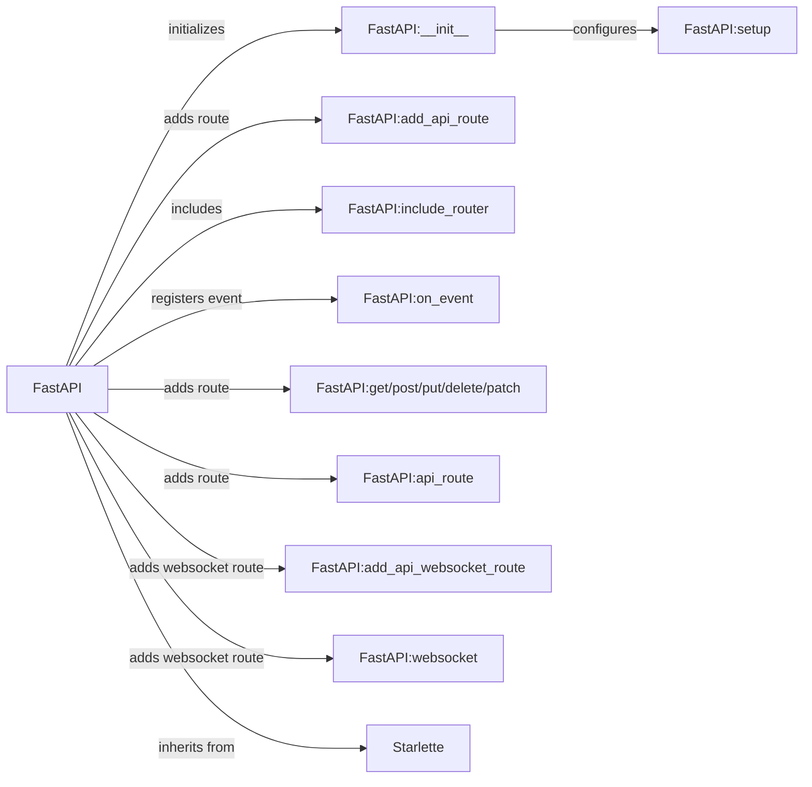

## Component Details

The FastAPI application core manages the lifecycle of the API, from initialization and configuration to routing and event handling. It leverages Starlette's functionalities and provides a high-level interface for defining API endpoints, middleware, and exception handlers. The core facilitates the creation of robust and scalable web applications by integrating routing, middleware, and dependency injection.

### FastAPI
The main application class, inheriting from Starlette, providing API functionalities like routing, middleware, and dependency injection. It serves as the central point for configuring and running the API.
- **Related Classes/Methods**: `fastapi/applications.py`

### FastAPI:__init__
Initializes the FastAPI application, setting up default exception handlers and middleware. It prepares the application instance for further configuration and route registration.
- **Related Classes/Methods**: `fastapi/applications.py`

### FastAPI:setup
Configures the FastAPI application, including setting up exception handlers and middleware. This method is responsible for setting up the application state.
- **Related Classes/Methods**: `fastapi/applications.py`

### FastAPI:add_api_route
Adds a new API route to the application for standard HTTP methods. It connects a specific URL path with a function that handles the request.
- **Related Classes/Methods**: `fastapi/applications.py`

### FastAPI:include_router
Includes a router (a collection of routes) into the main application. This allows for modular organization of API endpoints.
- **Related Classes/Methods**: `fastapi/applications.py`

### FastAPI:on_event
Registers a function to be executed on a specific event (startup or shutdown). This enables the application to perform actions during its lifecycle.
- **Related Classes/Methods**: `fastapi/applications.py`

### FastAPI:get/post/put/delete/patch
Decorators that are shorthand for adding routes to the application for the corresponding HTTP methods. They simplify the process of defining API endpoints.
- **Related Classes/Methods**: `fastapi/applications.py`

### FastAPI:api_route
A decorator that is a shorthand for adding a route to the application. It simplifies the process of defining API endpoints.
- **Related Classes/Methods**: `fastapi/applications.py`

### FastAPI:add_api_websocket_route
Adds a new API route to the application specifically for WebSocket endpoints. It connects a specific URL path with a function that handles the websocket request.
- **Related Classes/Methods**: `fastapi/applications.py`

### FastAPI:websocket
A decorator that is a shorthand for adding a websocket route to the application. It simplifies the process of defining API endpoints.
- **Related Classes/Methods**: `fastapi/applications.py`
