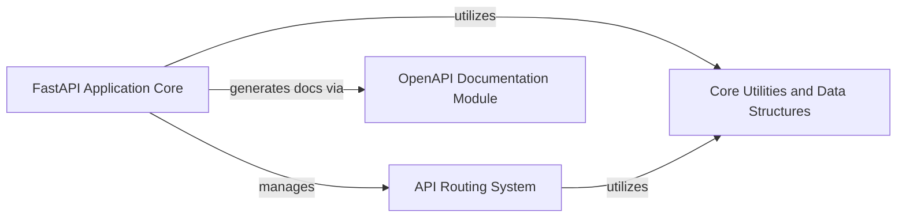

## Component Details

This graph outlines the core components of a FastAPI application. The 'FastAPI Application Core' acts as the central orchestrator, initializing the application, managing global settings, and defining API routes. It delegates routing responsibilities to the 'API Routing System' and leverages the 'OpenAPI Documentation Module' for automatic API documentation. Both the 'FastAPI Application Core' and the 'API Routing System' rely on the 'Core Utilities and Data Structures' for fundamental functionalities and data handling.

### FastAPI Application Core
The central component of a FastAPI application, responsible for initializing the application, managing global settings, and providing high-level methods for defining API routes (HTTP and WebSocket) and handling application lifecycle events. It acts as the primary interface for developers to build their web APIs.

**Related Classes/Methods**:

- <a href="https://github.com/fastapi/fastapi/blob/master/fastapi/applications.py#L48-L4585" target="_blank" rel="noopener noreferrer">`fastapi.fastapi.applications.FastAPI` (48:4585)</a>
- <a href="https://github.com/fastapi/fastapi/blob/master/fastapi/applications.py#L64-L964" target="_blank" rel="noopener noreferrer">`fastapi.fastapi.applications.FastAPI.__init__` (64:964)</a>
- <a href="https://github.com/fastapi/fastapi/blob/master/fastapi/applications.py#L966-L996" target="_blank" rel="noopener noreferrer">`fastapi.fastapi.applications.FastAPI.openapi` (966:996)</a>
- <a href="https://github.com/fastapi/fastapi/blob/master/fastapi/applications.py#L998-L1049" target="_blank" rel="noopener noreferrer">`fastapi.fastapi.applications.FastAPI.setup` (998:1049)</a>
- <a href="https://github.com/fastapi/fastapi/blob/master/fastapi/applications.py#L1056-L1113" target="_blank" rel="noopener noreferrer">`fastapi.fastapi.applications.FastAPI.add_api_route` (1056:1113)</a>
- <a href="https://github.com/fastapi/fastapi/blob/master/fastapi/applications.py#L1115-L1173" target="_blank" rel="noopener noreferrer">`fastapi.fastapi.applications.FastAPI.api_route` (1115:1173)</a>
- <a href="https://github.com/fastapi/fastapi/blob/master/fastapi/applications.py#L1175-L1188" target="_blank" rel="noopener noreferrer">`fastapi.fastapi.applications.FastAPI.add_api_websocket_route` (1175:1188)</a>
- <a href="https://github.com/fastapi/fastapi/blob/master/fastapi/applications.py#L1190-L1253" target="_blank" rel="noopener noreferrer">`fastapi.fastapi.applications.FastAPI.websocket` (1190:1253)</a>
- <a href="https://github.com/fastapi/fastapi/blob/master/fastapi/applications.py#L1255-L1458" target="_blank" rel="noopener noreferrer">`fastapi.fastapi.applications.FastAPI.include_router` (1255:1458)</a>
- <a href="https://github.com/fastapi/fastapi/blob/master/fastapi/applications.py#L1460-L1831" target="_blank" rel="noopener noreferrer">`fastapi.fastapi.applications.FastAPI.get` (1460:1831)</a>
- <a href="https://github.com/fastapi/fastapi/blob/master/fastapi/applications.py#L1833-L2209" target="_blank" rel="noopener noreferrer">`fastapi.fastapi.applications.FastAPI.put` (1833:2209)</a>
- <a href="https://github.com/fastapi/fastapi/blob/master/fastapi/applications.py#L2211-L2587" target="_blank" rel="noopener noreferrer">`fastapi.fastapi.applications.FastAPI.post` (2211:2587)</a>
- <a href="https://github.com/fastapi/fastapi/blob/master/fastapi/applications.py#L2589-L2960" target="_blank" rel="noopener noreferrer">`fastapi.fastapi.applications.FastAPI.delete` (2589:2960)</a>
- <a href="https://github.com/fastapi/fastapi/blob/master/fastapi/applications.py#L2962-L3333" target="_blank" rel="noopener noreferrer">`fastapi.fastapi.applications.FastAPI.options` (2962:3333)</a>
- <a href="https://github.com/fastapi/fastapi/blob/master/fastapi/applications.py#L3335-L3706" target="_blank" rel="noopener noreferrer">`fastapi.fastapi.applications.FastAPI.head` (3335:3706)</a>
- <a href="https://github.com/fastapi/fastapi/blob/master/fastapi/applications.py#L3708-L4084" target="_blank" rel="noopener noreferrer">`fastapi.fastapi.applications.FastAPI.patch` (3708:4084)</a>
- <a href="https://github.com/fastapi/fastapi/blob/master/fastapi/applications.py#L4086-L4457" target="_blank" rel="noopener noreferrer">`fastapi.fastapi.applications.FastAPI.trace` (4086:4457)</a>
- <a href="https://github.com/fastapi/fastapi/blob/master/fastapi/applications.py#L4476-L4495" target="_blank" rel="noopener noreferrer">`fastapi.fastapi.applications.FastAPI.on_event` (4476:4495)</a>

### API Routing System
Manages the registration and dispatching of API routes for both HTTP and WebSocket requests. This component is responsible for mapping incoming requests to the appropriate endpoint functions and handling the underlying routing logic. The FastAPI Application Core delegates route management to this system.

**Related Classes/Methods**:

- <a href="https://github.com/fastapi/fastapi/blob/master/fastapi/routing.py#L595-L4439" target="_blank" rel="noopener noreferrer">`fastapi.routing.APIRouter` (595:4439)</a>
- <a href="https://github.com/fastapi/fastapi/blob/master/fastapi/routing.py#L881-L961" target="_blank" rel="noopener noreferrer">`fastapi.routing.APIRouter.add_api_route` (881:961)</a>
- <a href="https://github.com/fastapi/fastapi/blob/master/fastapi/routing.py#L1025-L1044" target="_blank" rel="noopener noreferrer">`fastapi.routing.APIRouter.add_api_websocket_route` (1025:1044)</a>
- <a href="https://github.com/fastapi/fastapi/blob/master/fastapi/routing.py#L1366-L1741" target="_blank" rel="noopener noreferrer">`fastapi.routing.APIRouter.get` (1366:1741)</a>
- <a href="https://github.com/fastapi/fastapi/blob/master/fastapi/routing.py#L1743-L2123" target="_blank" rel="noopener noreferrer">`fastapi.routing.APIRouter.put` (1743:2123)</a>
- <a href="https://github.com/fastapi/fastapi/blob/master/fastapi/routing.py#L2125-L2505" target="_blank" rel="noopener noreferrer">`fastapi.routing.APIRouter.post` (2125:2505)</a>
- <a href="https://github.com/fastapi/fastapi/blob/master/fastapi/routing.py#L2507-L2882" target="_blank" rel="noopener noreferrer">`fastapi.routing.APIRouter.delete` (2507:2882)</a>
- <a href="https://github.com/fastapi/fastapi/blob/master/fastapi/routing.py#L2884-L3259" target="_blank" rel="noopener noreferrer">`fastapi.routing.APIRouter.options` (2884:3259)</a>
- <a href="https://github.com/fastapi/fastapi/blob/master/fastapi/routing.py#L3261-L3641" target="_blank" rel="noopener noreferrer">`fastapi.routing.APIRouter.head` (3261:3641)</a>
- <a href="https://github.com/fastapi/fastapi/blob/master/fastapi/routing.py#L3643-L4023" target="_blank" rel="noopener noreferrer">`fastapi.routing.APIRouter.patch` (3643:4023)</a>
- <a href="https://github.com/fastapi/fastapi/blob/master/fastapi/routing.py#L4025-L4405" target="_blank" rel="noopener noreferrer">`fastapi.routing.APIRouter.trace` (4025:4405)</a>
- <a href="https://github.com/fastapi/fastapi/blob/master/fastapi/routing.py#L4415-L4439" target="_blank" rel="noopener noreferrer">`fastapi.routing.APIRouter.on_event` (4415:4439)</a>
- <a href="https://github.com/fastapi/fastapi/blob/master/fastapi/routing.py#L126-L140" target="_blank" rel="noopener noreferrer">`fastapi.routing._merge_lifespan_context` (126:140)</a>

### OpenAPI Documentation Module
Responsible for generating the OpenAPI schema (formerly Swagger specification) for the API and serving the interactive documentation user interfaces, such as Swagger UI and ReDoc. This module allows for automatic API documentation based on the defined routes and models.

**Related Classes/Methods**:

- <a href="https://github.com/fastapi/fastapi/blob/master/fastapi/openapi/utils.py#L477-L569" target="_blank" rel="noopener noreferrer">`fastapi.openapi.utils.get_openapi` (477:569)</a>
- <a href="https://github.com/fastapi/fastapi/blob/master/fastapi/openapi/docs.py#L26-L158" target="_blank" rel="noopener noreferrer">`fastapi.openapi.docs.get_swagger_ui_html` (26:158)</a>
- <a href="https://github.com/fastapi/fastapi/blob/master/fastapi/openapi/docs.py#L256-L344" target="_blank" rel="noopener noreferrer">`fastapi.openapi.docs.get_swagger_ui_oauth2_redirect_html` (256:344)</a>
- <a href="https://github.com/fastapi/fastapi/blob/master/fastapi/openapi/docs.py#L161-L253" target="_blank" rel="noopener noreferrer">`fastapi.openapi.docs.get_redoc_html` (161:253)</a>

### Core Utilities and Data Structures
Provides fundamental utility functions and data structures used across the FastAPI framework. This includes mechanisms for handling default values in function signatures and defining custom exceptions for error handling within the application.

**Related Classes/Methods**:

- <a href="https://github.com/fastapi/fastapi/blob/master/fastapi/datastructures.py#L197-L204" target="_blank" rel="noopener noreferrer">`fastapi.datastructures.Default` (197:204)</a>
- <a href="https://github.com/fastapi/fastapi/blob/master/fastapi/exceptions.py#L143-L146" target="_blank" rel="noopener noreferrer">`fastapi.exceptions.FastAPIError` (143:146)</a>
- <a href="https://github.com/fastapi/fastapi/blob/master/fastapi/utils.py#L205-L220" target="_blank" rel="noopener noreferrer">`fastapi.utils.get_value_or_default` (205:220)</a>

### [FAQ](https://github.com/CodeBoarding/GeneratedOnBoardings/tree/main?tab=readme-ov-file#faq)