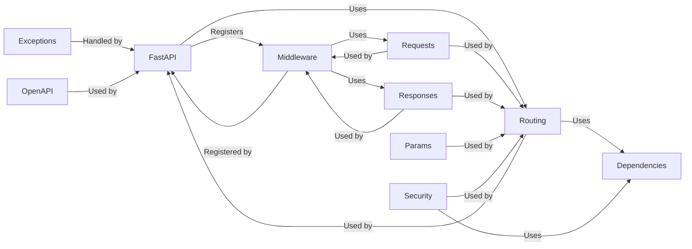

## Details

Component overview for the `Application Core` of the FastAPI application

### FastAPI
The core application class, inheriting from `APIRouter`. It's responsible for initializing and coordinating the entire FastAPI application. It manages the application lifecycle, includes routers, configures middleware, exception handlers, and generates the OpenAPI schema.

**Related Classes/Methods**: _None_

### Routing [[Expand]](./Routing.md)
Handles mapping URLs to endpoint functions (callables). `APIRouter` is used to group related endpoints, and `APIRoute` represents a single route.

**Related Classes/Methods**: _None_

### Dependencies
Manages dependency injection for endpoint functions. This allows for reusable and testable code.

**Related Classes/Methods**: _None_

### Requests
Provides access to incoming HTTP request data.

**Related Classes/Methods**: _None_

### Responses
Defines API responses, including status codes, headers, and content.

**Related Classes/Methods**: _None_

### Params
Defines and validates request parameters (query parameters, path parameters, headers, cookies, etc.).

**Related Classes/Methods**: _None_

### Security
Provides security utilities for authentication and authorization.

**Related Classes/Methods**: _None_

### Middleware
Processes requests before they reach endpoint functions and responses after they are generated.

**Related Classes/Methods**: _None_

### Exceptions
Defines custom exceptions used by FastAPI, including validation errors.

**Related Classes/Methods**: _None_

### OpenAPI
Generates OpenAPI schema for API documentation.

**Related Classes/Methods**: _None_

### [FAQ](https://github.com/CodeBoarding/GeneratedOnBoardings/tree/main?tab=readme-ov-file#faq)