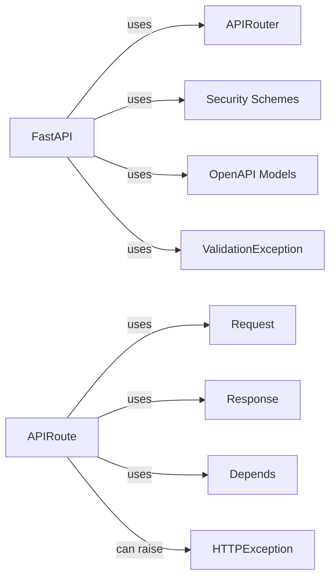

## Details

Component Overview for the `Application Core` of FastAPI.

### FastAPI
The core application class, inheriting from `APIRouter`. It manages the application lifecycle (startup, shutdown), configuration, and overall orchestration. It's the entry point for the FastAPI application, handling routing, middleware, exception handling, and dependency injection.

**Related Classes/Methods**: _None_

### APIRouter
Manages a set of related routes. It allows grouping routes under a common prefix and applying common middleware or dependencies. `FastAPI` inherits from `APIRouter`.

**Related Classes/Methods**: _None_

### APIRoute
Represents a single route within the application. It associates a URL path with a handler function (endpoint).

**Related Classes/Methods**: _None_

### Request
Provides access to incoming request data, such as headers, query parameters, and the request body.

**Related Classes/Methods**: _None_

### Response
Provides classes for returning different types of responses, such as JSON, HTML, or streaming responses.

**Related Classes/Methods**: _None_

### Depends
Handles dependency injection, allowing you to declare dependencies for your endpoint functions.

**Related Classes/Methods**: _None_

### HTTPException
A custom exception class for handling HTTP errors in the API.

**Related Classes/Methods**: _None_

### Security Schemes
Provides security utilities for authentication and authorization, including API key, HTTP Basic, and OAuth2 schemes.

**Related Classes/Methods**: _None_

### OpenAPI Models
Defines the data models used to generate the OpenAPI schema for the API.

**Related Classes/Methods**: _None_

### ValidationException
Base class for validation exceptions.

**Related Classes/Methods**: _None_

### [FAQ](https://github.com/CodeBoarding/GeneratedOnBoardings/tree/main?tab=readme-ov-file#faq)