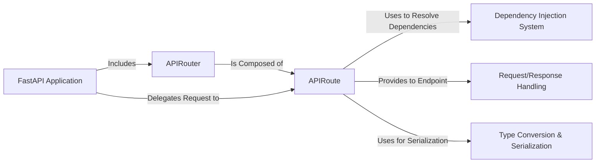

## Details

One paragraph explaining the functionality which is represented by this graph. What the main flow is and what is its purpose.

### FastAPI Application
The main application class and central orchestrator. It inherits from Starlette, manages configuration, and integrates all other components to handle the application lifecycle.

**Related Classes/Methods**:

- <a href="https://github.com/fastapi/fastapi/blob/master/fastapi/applications.py#L47-L4587" target="_blank" rel="noopener noreferrer">`fastapi.applications.FastAPI` (47:4587)</a>

### APIRouter
A mini-application that enables modular organization of endpoints. Routers group related routes into separate modules, which are then included in the main application.

**Related Classes/Methods**:

- <a href="https://github.com/fastapi/fastapi/blob/master/fastapi/routing.py#L595-L4439" target="_blank" rel="noopener noreferrer">`fastapi.routing.APIRouter` (595:4439)</a>

### APIRoute
Represents a single API endpoint, binding a path and HTTP method to an endpoint function. It manages request handling for that specific endpoint.

**Related Classes/Methods**:

- <a href="https://github.com/fastapi/fastapi/blob/master/fastapi/routing.py#L428-L592" target="_blank" rel="noopener noreferrer">`fastapi.routing.APIRoute` (428:592)</a>

### Dependency Injection System
The engine that resolves and injects dependencies into path operation functions. It inspects function signatures for `Depends` markers and manages the dependency graph.

**Related Classes/Methods**:

- <a href="https://github.com/fastapi/fastapi/blob/master/fastapi/params.py#L763-L773" target="_blank" rel="noopener noreferrer">`fastapi.params.Depends` (763:773)</a>
- `fastapi.dependencies.utils`

### Request/Response Handling
Provides the primary interface for interacting with HTTP data. These components are thin wrappers or direct re-exports from Starlette, representing the incoming request and outgoing response.

**Related Classes/Methods**:

- `fastapi.requests.Request`
- `fastapi.responses.Response`

### Type Conversion & Serialization
A crucial utility that converts complex Python objects (like Pydantic models) into JSON-compatible data structures, preparing them for the final HTTP response.

**Related Classes/Methods**:

- <a href="https://github.com/fastapi/fastapi/blob/master/fastapi/encoders.py#L101-L342" target="_blank" rel="noopener noreferrer">`fastapi.encoders.jsonable_encoder` (101:342)</a>

### [FAQ](https://github.com/CodeBoarding/GeneratedOnBoardings/tree/main?tab=readme-ov-file#faq)