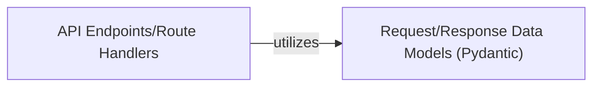

## Details

This FastAPI application primarily functions as a web API, with its core logic residing within its API endpoints. It leverages FastAPI's capabilities for routing and implicitly uses Pydantic for request and response data validation based on Python type hints. The application's simplicity means that business logic and data handling are currently integrated directly into the route handlers, rather than being delegated to separate service or data access layers.

### API Endpoints/Route Handlers
These are the async def functions decorated with FastAPI's HTTP method decorators (e.g., @app.get, @app.api_route). They serve as the primary entry points for specific HTTP requests, responsible for parsing input, executing direct logic, and constructing HTTP responses. They embody the direct interface of the application's API.

**Related Classes/Methods**:

### Request/Response Data Models (Pydantic)
Pydantic is implicitly used by FastAPI for automatic data validation and serialization based on Python type hints in route parameters (path, query) and response models. While explicit BaseModel classes are not defined in the provided main.py, type hints like item_id: int or query: Optional[int] leverage Pydantic for data integrity, validation, and automatic OpenAPI schema generation.

**Related Classes/Methods**:

### [FAQ](https://github.com/CodeBoarding/GeneratedOnBoardings/tree/main?tab=readme-ov-file#faq)