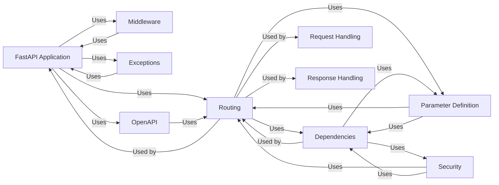

## Details

Components of the FastAPI application and their relations.

### FastAPI Application
The central component, inheriting from Starlette's `Starlette` class. It's responsible for initializing the application, configuring middleware, exception handlers, and integrating the routing system. It also handles the creation of the OpenAPI schema.

**Related Classes/Methods**: _None_

### Routing
Handles the mapping of URL paths and HTTP methods to specific functions (endpoint handlers). Includes `APIRoute` for individual route definitions and `APIRouter` for grouping related routes.

**Related Classes/Methods**: _None_

### Dependencies
Manages dependency injection for route handlers. Allows defining dependencies that are automatically resolved and injected into endpoint functions.

**Related Classes/Methods**: _None_

### Parameter Definition
Defines parameter types (`Query`, `Path`, `Body`, etc.) for declaring request parameters in route handlers and dependencies.

**Related Classes/Methods**: _None_

### Request Handling
Provides the `Request` class for accessing incoming request data (headers, body, query parameters).

**Related Classes/Methods**: _None_

### Response Handling [[Expand]](./Response_Handling.md)
Defines response classes (e.g., `JSONResponse`, `HTMLResponse`) for sending data back to the client.

**Related Classes/Methods**: _None_

### Security
Provides security utilities, including authentication and authorization mechanisms (API key, HTTP Basic Auth, OAuth2).

**Related Classes/Methods**: _None_

### Middleware
Implements middleware components for request pre-processing and response post-processing (CORS, GZip, etc.).

**Related Classes/Methods**: _None_

### Exceptions
Defines custom exception classes used within FastAPI, including validation exceptions, and exception handlers.

**Related Classes/Methods**: _None_

### OpenAPI
Generates OpenAPI schema for API documentation.

**Related Classes/Methods**: _None_

### [FAQ](https://github.com/CodeBoarding/GeneratedOnBoardings/tree/main?tab=readme-ov-file#faq)