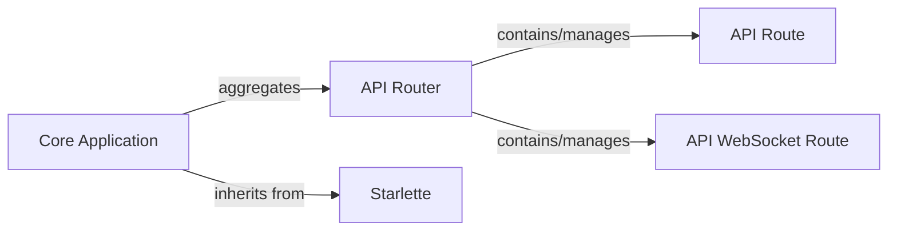

## Details

Abstract Components Overview

### Core Application
This is the central orchestrator and entry point of the FastAPI application. It initializes the ASGI application, registers global event handlers (like startup and shutdown), configures middleware, and aggregates all defined API routes. As it inherits from `Starlette`, it gains core ASGI application functionalities. It aggregates an `APIRouter` instance to manage routing capabilities and is responsible for generating the comprehensive OpenAPI schema for the entire API.

**Related Classes/Methods**:

- <a href="https://github.com/fastapi/fastapi/fastapi/applications.py#L47-L4584" target="_blank" rel="noopener noreferrer">`fastapi.applications.FastAPI` (47:4584)</a>

### API Router
`APIRouter` provides a modular and organized way to group related API endpoints. It allows for the creation of sub-APIs that can be included in the main `FastAPI` application or nested within other routers. This promotes code reusability and maintainability, aligning with the microservices and layered architecture patterns.

**Related Classes/Methods**:

- <a href="https://github.com/fastapi/fastapi/fastapi/routing.py#L594-L4438" target="_blank" rel="noopener noreferrer">`fastapi.routing.APIRouter` (594:4438)</a>

### API Route
This component represents a single HTTP endpoint (e.g., GET, POST, PUT). It encapsulates all the details of a specific API operation, including its path, HTTP methods, dependencies, request/response models, and the actual Python function (path operation function) that executes the business logic for that endpoint.

**Related Classes/Methods**:

- <a href="https://github.com/fastapi/fastapi/fastapi/routing.py#L427-L591" target="_blank" rel="noopener noreferrer">`fastapi.routing.APIRoute` (427:591)</a>

### API WebSocket Route
Similar to `APIRoute`, but specifically designed to handle WebSocket connections. It manages the lifecycle of WebSocket interactions, allowing for real-time, bidirectional communication within the FastAPI application.

**Related Classes/Methods**:

- <a href="https://github.com/fastapi/fastapi/fastapi/routing.py#L387-L424" target="_blank" rel="noopener noreferrer">`fastapi.routing.APIWebSocketRoute` (387:424)</a>

### [FAQ](https://github.com/CodeBoarding/GeneratedOnBoardings/tree/main?tab=readme-ov-file#faq)