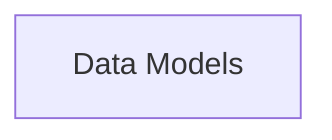

## Details

Data Models are fundamental because they provide a structured and type-safe way to handle data within the API. By using Pydantic, the framework can automatically validate data, serialize/deserialize objects, and generate OpenAPI schemas. This reduces boilerplate code, improves data consistency, and simplifies API development.

### Data Models [[Expand]](./Data_Models.md)
This component defines the structure and validation rules for request and response data within the API. It leverages Pydantic to create data models that enforce type hints, perform data validation, and handle serialization/deserialization. Data Models are central to ensuring data consistency and integrity throughout the application.

**Related Classes/Methods**: _None_

### [FAQ](https://github.com/CodeBoarding/GeneratedOnBoardings/tree/main?tab=readme-ov-file#faq)