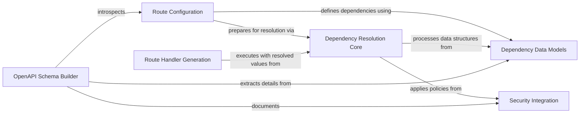

## Component Details

This component overview details the FastAPI Dependency Injection System, which is crucial for managing and resolving dependencies for path operations and WebSocket connections. It encompasses the core logic for analyzing function signatures, extracting parameters, handling complex dependency types like generators, and integrating security requirements. The system works in conjunction with routing to prepare request handlers and with OpenAPI generation to document the API's structure and requirements.

### Dependency Resolution Core
The central mechanism for recursively analyzing, resolving, and injecting dependencies into callable functions (path operations, WebSocket handlers, and sub-dependencies). It manages the lifecycle of generator-based dependencies and handles parameter extraction from requests.

**Related Classes/Methods**:

- <a href="https://github.com/fastapi/fastapi/blob/master/fastapi/dependencies/utils.py#L572-L695" target="_blank" rel="noopener noreferrer">`fastapi.dependencies.utils.solve_dependencies` (572:695)</a>
- <a href="https://github.com/fastapi/fastapi/blob/master/fastapi/dependencies/utils.py#L265-L314" target="_blank" rel="noopener noreferrer">`fastapi.dependencies.utils.get_dependant` (265:314)</a>
- <a href="https://github.com/fastapi/fastapi/blob/master/fastapi/dependencies/utils.py#L348-L511" target="_blank" rel="noopener noreferrer">`fastapi.dependencies.utils.analyze_param` (348:511)</a>
- <a href="https://github.com/fastapi/fastapi/blob/master/fastapi/dependencies/utils.py#L553-L560" target="_blank" rel="noopener noreferrer">`fastapi.dependencies.utils.solve_generator` (553:560)</a>
- <a href="https://github.com/fastapi/fastapi/blob/master/fastapi/dependencies/utils.py#L118-L132" target="_blank" rel="noopener noreferrer">`fastapi.dependencies.utils.get_param_sub_dependant` (118:132)</a>
- <a href="https://github.com/fastapi/fastapi/blob/master/fastapi/dependencies/utils.py#L135-L139" target="_blank" rel="noopener noreferrer">`fastapi.dependencies.utils.get_parameterless_sub_dependant` (135:139)</a>
- <a href="https://github.com/fastapi/fastapi/blob/master/fastapi/dependencies/utils.py#L142-L171" target="_blank" rel="noopener noreferrer">`fastapi.dependencies.utils.get_sub_dependant` (142:171)</a>
- <a href="https://github.com/fastapi/fastapi/blob/master/fastapi/dependencies/utils.py#L546-L550" target="_blank" rel="noopener noreferrer">`fastapi.dependencies.utils.is_gen_callable` (546:550)</a>
- <a href="https://github.com/fastapi/fastapi/blob/master/fastapi/dependencies/utils.py#L539-L543" target="_blank" rel="noopener noreferrer">`fastapi.dependencies.utils.is_async_gen_callable` (539:543)</a>

### Dependency Data Models
Defines the structured data representations for dependencies, including information about the callable, its parameters, sub-dependencies, and security requirements. These models facilitate the internal processing and communication within the dependency injection system.

**Related Classes/Methods**:

- <a href="https://github.com/fastapi/fastapi/blob/master/fastapi/dependencies/models.py#L15-L37" target="_blank" rel="noopener noreferrer">`fastapi.dependencies.models.Dependant` (15:37)</a>
- <a href="https://github.com/fastapi/fastapi/blob/master/fastapi/dependencies/models.py#L9-L11" target="_blank" rel="noopener noreferrer">`fastapi.dependencies.models.SecurityRequirement` (9:11)</a>
- <a href="https://github.com/fastapi/fastapi/blob/master/fastapi/dependencies/utils.py#L342-L345" target="_blank" rel="noopener noreferrer">`fastapi.dependencies.utils.ParamDetails` (342:345)</a>
- <a href="https://github.com/fastapi/fastapi/blob/master/fastapi/dependencies/utils.py#L564-L569" target="_blank" rel="noopener noreferrer">`fastapi.dependencies.utils.SolvedDependency` (564:569)</a>

### Security Integration
Provides abstract and concrete implementations for various security schemes (e.g., API Key, HTTP Basic, OAuth2). It defines how security requirements are declared and how credentials are extracted from incoming requests, integrating with the dependency resolution process.

**Related Classes/Methods**:

- <a href="https://github.com/fastapi/fastapi/blob/master/fastapi/security/base.py#L4-L6" target="_blank" rel="noopener noreferrer">`fastapi.security.base.SecurityBase` (4:6)</a>
- <a href="https://github.com/fastapi/fastapi/blob/master/fastapi/security/api_key.py#L11-L20" target="_blank" rel="noopener noreferrer">`fastapi.security.api_key.APIKeyBase` (11:20)</a>
- <a href="https://github.com/fastapi/fastapi/blob/master/fastapi/security/http.py#L69-L94" target="_blank" rel="noopener noreferrer">`fastapi.security.http.HTTPBase` (69:94)</a>
- <a href="https://github.com/fastapi/fastapi/blob/master/fastapi/security/oauth2.py#L308-L388" target="_blank" rel="noopener noreferrer">`fastapi.security.oauth2.OAuth2` (308:388)</a>
- <a href="https://github.com/fastapi/fastapi/blob/master/fastapi/security/open_id_connect_url.py#L11-L84" target="_blank" rel="noopener noreferrer">`fastapi.security.open_id_connect_url.OpenIdConnect` (11:84)</a>
- <a href="https://github.com/fastapi/fastapi/blob/master/fastapi/params.py#L777-L786" target="_blank" rel="noopener noreferrer">`fastapi.params.Security` (777:786)</a>

### Route Handler Generation
Responsible for creating the actual ASGI application callable for HTTP and WebSocket routes. It orchestrates the dependency resolution, request body parsing, endpoint execution, and response serialization based on the defined route and its dependencies.

**Related Classes/Methods**:

- <a href="https://github.com/fastapi/fastapi/blob/master/fastapi/routing.py#L217-L357" target="_blank" rel="noopener noreferrer">`fastapi.routing.get_request_handler` (217:357)</a>
- <a href="https://github.com/fastapi/fastapi/blob/master/fastapi/routing.py#L360-L385" target="_blank" rel="noopener noreferrer">`fastapi.routing.get_websocket_app` (360:385)</a>

### Route Configuration
Manages the definition and initialization of API routes (HTTP and WebSocket). It analyzes the endpoint's signature to build the dependency graph and prepares the route for handling requests by integrating with the dependency resolution and OpenAPI generation components.

**Related Classes/Methods**:

- <a href="https://github.com/fastapi/fastapi/blob/master/fastapi/routing.py#L429-L569" target="_blank" rel="noopener noreferrer">`fastapi.routing.APIRoute.__init__` (429:569)</a>
- <a href="https://github.com/fastapi/fastapi/blob/master/fastapi/routing.py#L389-L419" target="_blank" rel="noopener noreferrer">`fastapi.routing.APIWebSocketRoute.__init__` (389:419)</a>
- <a href="https://github.com/fastapi/fastapi/blob/master/fastapi/dependencies/utils.py#L177-L209" target="_blank" rel="noopener noreferrer">`fastapi.dependencies.utils.get_flat_dependant` (177:209)</a>
- <a href="https://github.com/fastapi/fastapi/blob/master/fastapi/dependencies/utils.py#L222-L228" target="_blank" rel="noopener noreferrer">`fastapi.dependencies.utils.get_flat_params` (222:228)</a>
- <a href="https://github.com/fastapi/fastapi/blob/master/fastapi/dependencies/utils.py#L819-L838" target="_blank" rel="noopener noreferrer">`fastapi.dependencies.utils._should_embed_body_fields` (819:838)</a>
- <a href="https://github.com/fastapi/fastapi/blob/master/fastapi/dependencies/utils.py#L930-L980" target="_blank" rel="noopener noreferrer">`fastapi.dependencies.utils.get_body_field` (930:980)</a>

### OpenAPI Schema Builder
Generates the OpenAPI schema for the entire API. It introspects the configured routes and their dependencies to extract parameter details, request bodies, responses, and security definitions, compiling them into a comprehensive API documentation.

**Related Classes/Methods**:

- <a href="https://github.com/fastapi/fastapi/blob/master/fastapi/openapi/utils.py#L477-L569" target="_blank" rel="noopener noreferrer">`fastapi.openapi.utils.get_openapi` (477:569)</a>
- <a href="https://github.com/fastapi/fastapi/blob/master/fastapi/openapi/utils.py#L254-L443" target="_blank" rel="noopener noreferrer">`fastapi.openapi.utils.get_openapi_path` (254:443)</a>
- <a href="https://github.com/fastapi/fastapi/blob/master/fastapi/openapi/utils.py#L95-L167" target="_blank" rel="noopener noreferrer">`fastapi.openapi.utils._get_openapi_operation_parameters` (95:167)</a>
- <a href="https://github.com/fastapi/fastapi/blob/master/fastapi/openapi/utils.py#L446-L474" target="_blank" rel="noopener noreferrer">`fastapi.openapi.utils.get_fields_from_routes` (446:474)</a>

### [FAQ](https://github.com/CodeBoarding/GeneratedOnBoardings/tree/main?tab=readme-ov-file#faq)