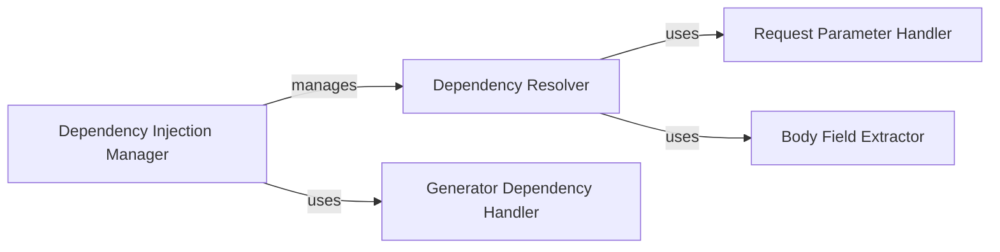

## Component Details

The Dependency Injection system in FastAPI manages the creation, resolution, and injection of dependencies into route handlers. It ensures that the necessary dependencies are available when a route is executed, handling various dependency types, including simple values, callables, generators, and context managers. The system builds a dependency graph, resolves dependencies based on request data, and manages the lifecycle of generator-based dependencies.

### Dependency Injection Manager
This component serves as the central orchestrator for the dependency injection process. It constructs the dependency graph using `get_dependant`, resolves dependencies using `solve_dependencies`, and manages the lifecycle of generator dependencies using `solve_generator`. It ensures that all dependencies are resolved and injected into the route handler before execution.
- **Related Classes/Methods**:

['[`fastapi.fastapi.dependencies.utils:get_dependant` (265:314)](https://github.com/fastapi/fastapi/blob/master/fastapi/dependencies/utils.py#L265-L314)', '[`fastapi.fastapi.dependencies.utils:solve_dependencies` (572:695)](https://github.com/fastapi/fastapi/blob/master/fastapi/dependencies/utils.py#L572-L695)', '[`fastapi.fastapi.dependencies.utils:solve_generator` (553:560)](https://github.com/fastapi/fastapi/blob/master/fastapi/dependencies/utils.py#L553-L560)']

### Dependency Resolver
The Dependency Resolver is responsible for recursively traversing the dependency graph and resolving individual dependencies. It uses functions like `get_flat_dependant`, `get_parameterless_sub_dependant`, and `get_sub_dependant` to handle different types of dependencies. It interacts with the Request Parameter Handler and Body Field Extractor to obtain values for dependencies based on request data.
- **Related Classes/Methods**:

['[`fastapi.dependencies.utils.get_flat_dependant` (177:209)](https://github.com/fastapi/fastapi/blob/master/fastapi/dependencies/utils.py#L177-L209)', '[`fastapi.dependencies.utils.get_parameterless_sub_dependant` (135:139)](https://github.com/fastapi/fastapi/blob/master/fastapi/dependencies/utils.py#L135-L139)', '[`fastapi.dependencies.utils.get_sub_dependant` (142:171)](https://github.com/fastapi/fastapi/blob/master/fastapi/dependencies/utils.py#L142-L171)']

### Request Parameter Handler
This component extracts and validates request parameters, converting them to the appropriate types. It uses `request_params_to_args` to extract parameters from the request. It provides the resolved parameters to the Dependency Resolver.
- **Related Classes/Methods**:

['[`fastapi.fastapi.dependencies.utils:request_params_to_args` (740:816)](https://github.com/fastapi/fastapi/blob/master/fastapi/dependencies/utils.py#L740-L816)']

### Body Field Extractor
The Body Field Extractor is responsible for extracting body fields from the request. It uses `get_body_field` to extract the body field based on the request and field definitions. The extracted body fields are then provided to the Dependency Resolver.
- **Related Classes/Methods**:

['[`fastapi.fastapi.dependencies.utils:get_body_field` (930:980)](https://github.com/fastapi/fastapi/blob/master/fastapi/dependencies/utils.py#L930-L980)']

### Generator Dependency Handler
This component manages the lifecycle of dependencies that are generators or context managers. It uses `solve_generator` to ensure that these dependencies are properly initialized and closed, handling their execution within the request lifecycle. It is invoked by the Dependency Injection Manager during dependency resolution.
- **Related Classes/Methods**:

['[`fastapi.fastapi.dependencies.utils:solve_generator` (553:560)](https://github.com/fastapi/fastapi/blob/master/fastapi/dependencies/utils.py#L553-L560)']