## Dependency Injection in FastAPI

This diagram illustrates the flow of dependency injection in FastAPI, focusing on how dependencies are resolved and injected into endpoint handler functions.

```mermaid
graph LR
    FastAPIApp((FastAPI Application)) -- Defines Routes --> APIRouterInstance((APIRouter))
    APIRouterInstance -- Includes --> APIRouteInstance((APIRoute))
    APIRouteInstance -- Uses --> solve_dependencies((solve_dependencies))
    solve_dependencies -- Uses --> get_dependant((get_dependant))
    get_dependant -- Analyzes --> analyze_param((analyze_param))
    analyze_param -- Identifies --> Path["Path Parameter"]
    analyze_param -- Identifies --> Query["Query Parameter"]
    analyze_param -- Identifies --> Body["Body Parameter"]
    analyze_param -- Identifies --> Depends["Depends (Dependency Declaration)"]
    Depends -- Resolves --> solve_dependencies
    solve_dependencies -- Provides --> EndpointHandler(("Endpoint Handler Function"))




















































































































































































































































































































































































































































































































































































































































































































































































































































































































































































































































































































































































































































































































































































































































































































































































































































































































































































































































































































































































































































































































































































































































































































































































































































































































```

## Components:

*   **FastAPI Application**: The central component that manages the API. It receives requests, routes them to the appropriate handler, and returns responses. It uses `APIRouter` to organize routes. **Relevant source file**: `fastapi.applications.FastAPI`
*   **APIRouter**: Organizes and groups related API endpoints. It defines routes in a modular way and includes them in the main FastAPI application. **Relevant source file**: `fastapi.routing.APIRouter`
*   **APIRoute**: Represents a single API endpoint, defining the path, HTTP method, and handler function. It processes requests and generates responses. **Relevant source file**: `fastapi.routing.APIRoute`
*   **solve_dependencies**: Resolves the dependencies of an endpoint's handler function using the dependency injection system. It provides the required dependencies to the handler. It uses `get_dependant` to analyze dependencies. **Relevant source file**: `fastapi.dependencies.utils.solve_dependencies`
*   **get_dependant**: Analyzes the dependencies of a callable and returns a Dependant object, encapsulating dependency information. It uses `analyze_param` to analyze individual parameters. **Relevant source file**: `fastapi.dependencies.utils.get_dependant`
*   **analyze_param**: Analyzes a single parameter of a callable and extracts dependency information. It identifies if a parameter is a path, query, or body parameter, or a declared dependency via `Depends`. **Relevant source file**: `fastapi.dependencies.utils.analyze_param`
*   **Path Parameter**: Defines a path parameter in an API endpoint, extracting values from the URL path. **Relevant source file**: `fastapi.params.Path`
*   **Query Parameter**: Defines a query parameter in an API endpoint, extracting values from the URL query string. **Relevant source file**: `fastapi.params.Query`
*   **Body Parameter**: Defines a request body parameter in an API endpoint, extracting data from the request body. **Relevant source file**: `fastapi.params.Body`
*   **Depends**: Declares dependencies for an endpoint. FastAPI resolves these dependencies and injects them into the endpoint's function using `solve_dependencies`. **Relevant source file**: `fastapi.param_functions.Depends`
*   **Endpoint Handler Function**: The function that handles the API request. It receives the injected dependencies and processes the request to generate a response.

