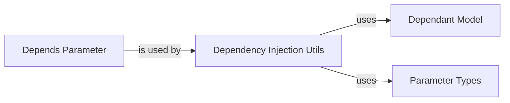

## Component Details

The dependency injection system in FastAPI allows developers to declare dependencies for their API endpoints. It resolves these dependencies and injects them into the handler functions, managing their lifecycle. This promotes code reusability, testability, and maintainability. The core components involved are the Dependant model, which represents a single dependency, the Depends parameter, which is used to declare dependencies in endpoint functions, and the utility functions that handle the dependency resolution process.

### Dependency Injection Utils
This component provides utility functions for dependency injection, including analyzing dependencies, solving dependencies, and injecting dependencies into endpoint functions. It orchestrates the entire dependency resolution process, from analyzing the parameters of a function to injecting the resolved dependencies into the function call.
- **Related Classes/Methods**:

- <a href="https://github.com/fastapi/fastapi/blob/master/fastapi/dependencies/utils.py#L265-L314" target="_blank" rel="noopener noreferrer">`fastapi.dependencies.utils:get_dependant` (265:314)</a>
- <a href="https://github.com/fastapi/fastapi/blob/master/fastapi/dependencies/utils.py#L572-L695" target="_blank" rel="noopener noreferrer">`fastapi.dependencies.utils:solve_dependencies` (572:695)</a>
- <a href="https://github.com/fastapi/fastapi/blob/master/fastapi/dependencies/utils.py#L553-L560" target="_blank" rel="noopener noreferrer">`fastapi.dependencies.utils:solve_generator` (553:560)</a>
- <a href="https://github.com/fastapi/fastapi/blob/master/fastapi/dependencies/utils.py#L142-L171" target="_blank" rel="noopener noreferrer">`fastapi.dependencies.utils:get_sub_dependant` (142:171)</a>
- <a href="https://github.com/fastapi/fastapi/blob/master/fastapi/dependencies/utils.py#L177-L209" target="_blank" rel="noopener noreferrer">`fastapi.dependencies.utils:get_flat_dependant` (177:209)</a>
- <a href="https://github.com/fastapi/fastapi/blob/master/fastapi/dependencies/utils.py#L348-L511" target="_blank" rel="noopener noreferrer">`fastapi.dependencies.utils:analyze_param` (348:511)</a>
- <a href="https://github.com/fastapi/fastapi/blob/master/fastapi/dependencies/utils.py#L740-L816" target="_blank" rel="noopener noreferrer">`fastapi.dependencies.utils:request_params_to_args` (740:816)</a>
- <a href="https://github.com/fastapi/fastapi/blob/master/fastapi/dependencies/utils.py#L884-L927" target="_blank" rel="noopener noreferrer">`fastapi.dependencies.utils:request_body_to_args` (884:927)</a>
- <a href="https://github.com/fastapi/fastapi/blob/master/fastapi/dependencies/utils.py#L930-L980" target="_blank" rel="noopener noreferrer">`fastapi.dependencies.utils:get_body_field` (930:980)</a>

### Dependant Model
This component represents a dependency and its relationships. It stores information about the dependency, such as its type, default value, and whether it is required. It acts as a data structure that holds all the necessary information about a single dependency that needs to be resolved.
- **Related Classes/Methods**:

- <a href="https://github.com/fastapi/fastapi/blob/master/fastapi/dependencies/models.py#L15-L37" target="_blank" rel="noopener noreferrer">`fastapi.dependencies.models.Dependant` (15:37)</a>

### Depends Parameter
This component is used to declare dependencies in endpoint functions. It takes a callable as an argument, which is the dependency to be injected. When FastAPI encounters a `Depends` parameter, it uses the dependency injection system to resolve the dependency and inject it into the endpoint function.
- **Related Classes/Methods**:

- <a href="https://github.com/fastapi/fastapi/blob/master/fastapi/params.py#L764-L774" target="_blank" rel="noopener noreferrer">`fastapi.params.Depends` (764:774)</a>

### Parameter Types
This component defines parameter types for endpoint functions, such as `Path`, `Query`, `Body`, and `File`. These classes are used to specify how parameters should be extracted from the request. They provide a way to define how data is passed to the endpoint functions.
- **Related Classes/Methods**:

- <a href="https://github.com/fastapi/fastapi/blob/master/fastapi/params.py#L139-L222" target="_blank" rel="noopener noreferrer">`fastapi.params.Path` (139:222)</a>
- <a href="https://github.com/fastapi/fastapi/blob/master/fastapi/params.py#L680-L761" target="_blank" rel="noopener noreferrer">`fastapi.params.File` (680:761)</a>
- <a href="https://github.com/fastapi/fastapi/blob/master/fastapi/params.py#L479-L593" target="_blank" rel="noopener noreferrer">`fastapi.params.Body` (479:593)</a>
- <a href="https://github.com/fastapi/fastapi/blob/master/fastapi/params.py#L225-L306" target="_blank" rel="noopener noreferrer">`fastapi.params.Query` (225:306)</a>