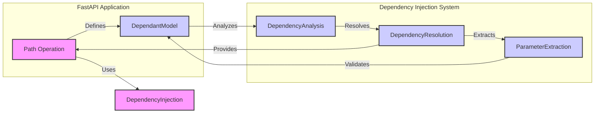

```mermaid
graph LR
    subgraph FastAPI Application
        PathOperation[Path Operation] -- Defines --> DependantModel
    end

    subgraph Dependency Injection System
        DependantModel -- Analyzes --> DependencyAnalysis
        DependencyAnalysis -- Resolves --> DependencyResolution
        DependencyResolution -- Extracts --> ParameterExtraction
        ParameterExtraction -- Validates --> DependantModel
        DependencyResolution -- Provides --> PathOperation
    end

    PathOperation -- Uses --> DependencyInjection

    style PathOperation fill:#f9f,stroke:#333,stroke-width:2px
    style DependantModel fill:#ccf,stroke:#333,stroke-width:2px
    style DependencyAnalysis fill:#ccf,stroke:#333,stroke-width:2px
    style DependencyResolution fill:#ccf,stroke:#333,stroke-width:2px
    style ParameterExtraction fill:#ccf,stroke:#333,stroke-width:2px
    style DependencyInjection fill:#f9f,stroke:#333,stroke-width:2px


```

