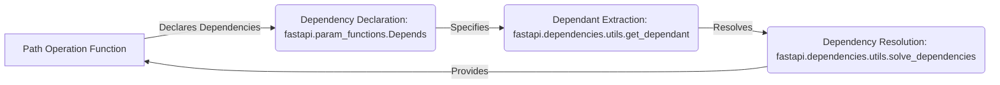

```mermaid
graph LR
    A[Path Operation Function] -- Declares Dependencies --> B(Dependency Declaration: fastapi.param_functions.Depends)
    B -- Specifies --> C(Dependant Extraction: fastapi.dependencies.utils.get_dependant)
    C -- Resolves --> D(Dependency Resolution: fastapi.dependencies.utils.solve_dependencies)
    D -- Provides --> A


```