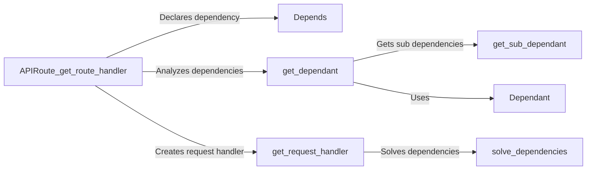

## Component Details

The dependency injection system in FastAPI allows developers to declare dependencies for path operation functions. When a request is made, FastAPI resolves these dependencies, providing the necessary resources to the function. This system promotes code reusability, testability, and modularity. The core of the system involves analyzing the dependencies of a function, resolving them using request data and other dependencies, and then passing the resolved dependencies to the function.

### Depends
The `Depends` marker is used to declare a dependency for a path operation function. It indicates that a parameter should be resolved using dependency injection. It essentially tells FastAPI to look up and inject a value for the parameter when the function is called.
- **Related Classes/Methods**: `fastapi.params.Depends`

### get_dependant
The `get_dependant` function analyzes the dependencies of a callable (e.g., a route handler) and returns a `Dependant` object describing the dependencies. This analysis includes identifying parameters, sub-dependencies, and body fields. It's the first step in understanding what needs to be resolved for a given function.
- **Related Classes/Methods**: `fastapi/dependencies/utils.py.get_dependant`

### get_sub_dependant
The `get_sub_dependant` function recursively retrieves sub-dependencies from a dependency. This is important for handling nested dependencies, where one dependency itself depends on other dependencies. It ensures that all dependencies, no matter how deeply nested, are identified and resolved.
- **Related Classes/Methods**: `fastapi/dependencies/utils.py.get_sub_dependant`

### solve_dependencies
The `solve_dependencies` function resolves the dependencies of a path operation function by calling the dependency functions and handling generators. It uses the request data to provide values for the dependencies. This is where the actual resolution of dependencies happens, using the request context and potentially other resolved dependencies.
- **Related Classes/Methods**: `fastapi/dependencies/utils.py.solve_dependencies`

### get_request_handler
The `get_request_handler` function creates a request handler function that extracts data from the request (query parameters, path parameters, body), resolves dependencies, and then calls the path operation function with the extracted data and resolved dependencies. It orchestrates the entire process of handling a request, from data extraction to dependency resolution to function invocation.
- **Related Classes/Methods**: `fastapi/routing.py.get_request_handler`

### Dependant
The `Dependant` class is a data structure that holds information about the dependencies of a callable, including parameters, sub-dependencies, and body fields. It's a central data structure that encapsulates all the information needed to resolve dependencies for a given function.
- **Related Classes/Methods**: `fastapi/dependencies/models.py.Dependant`
