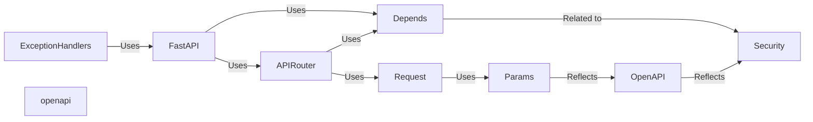

## Details

Dependency Injection in FastAPI

### FastAPI
The core application class. It's responsible for initializing the application and handling incoming requests. It uses the `Depends` class to resolve dependencies for route handlers.

**Related Classes/Methods**: _None_

### APIRouter
A class for creating modular sets of API routes. It allows grouping related endpoints and applying common configurations, including dependency injection.

**Related Classes/Methods**: _None_

### Depends
A central class/function used for declaring dependencies. It specifies a callable (function, class, or other) that will be executed to provide a value to a route handler.

**Related Classes/Methods**: _None_

### Request
Represents an incoming HTTP request. Provides access to request data, headers, and other relevant information that can be used as dependencies.

**Related Classes/Methods**: _None_

### Params
Defines classes for declaring request parameters (query, path, header, cookie, body, form, file). These are injected as dependencies.

**Related Classes/Methods**: _None_

### Security
Provides various security schemes for authentication and authorization, often used as dependencies.

**Related Classes/Methods**: _None_

### ExceptionHandlers
Handles exceptions raised during request processing, including validation errors related to dependency injection.

**Related Classes/Methods**: _None_

### openapi
Generates OpenAPI schema, reflecting dependencies and security requirements.

**Related Classes/Methods**: _None_

### [FAQ](https://github.com/CodeBoarding/GeneratedOnBoardings/tree/main?tab=readme-ov-file#faq)