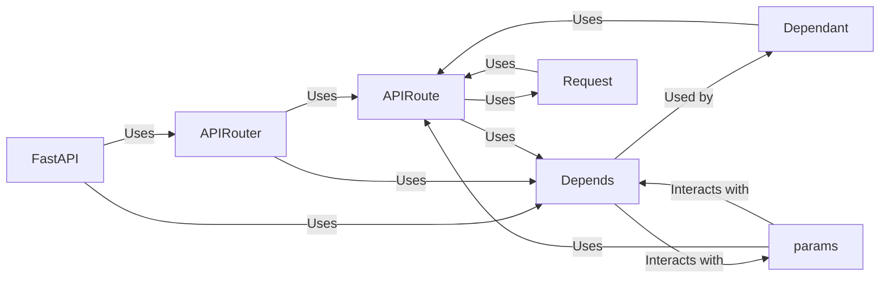

## Details

Component Overview: Dependency Injection in FastAPI

### FastAPI
The core application class, inheriting from `APIRouter`. It's the central point for creating API instances, handling requests, and managing middleware. It orchestrates the dependency injection process.

**Related Classes/Methods**: _None_

### APIRouter
A class for creating modular sets of routes. It allows grouping related endpoints and applying common configurations, including dependencies.

**Related Classes/Methods**: _None_

### APIRoute
Represents a single route (endpoint) in the API. It defines how a specific URL path is handled, including the dependencies required by the endpoint function.

**Related Classes/Methods**: _None_

### Depends
A function/class used for dependency injection. It specifies a dependency that needs to be resolved and injected into an endpoint function.

**Related Classes/Methods**: _None_

### Dependant
A data structure that holds information about the dependencies of a route, including the callable to resolve the dependency, any sub-dependencies, and security requirements.

**Related Classes/Methods**: _None_

### Request
Represents an incoming HTTP request. It provides access to request headers, query parameters, body, and other request-related information. Dependencies can use `Request` to access request-specific data.

**Related Classes/Methods**: _None_

### params
Defines classes for declaring request parameters (query, path, header, cookie, body). These parameters can also be dependencies.

**Related Classes/Methods**: _None_

### [FAQ](https://github.com/CodeBoarding/GeneratedOnBoardings/tree/main?tab=readme-ov-file#faq)