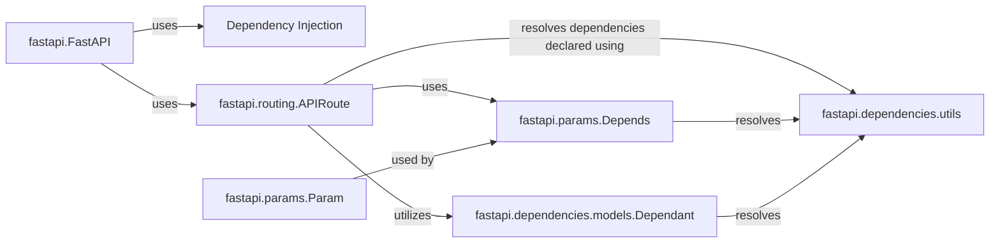

## Details

These components are fundamental because they enable FastAPI's dependency injection system, a core feature for building maintainable and testable APIs. Dependency injection promotes loose coupling, making it easier to swap out implementations, mock dependencies for testing, and manage complex application architectures. The `FastAPI` class relies on the `Dependencies` component to handle the injection of resources into route handlers. `APIRoute`, `Dependant`, and `Depends` work together to define and manage dependencies for individual routes.

### Dependency Injection [[Expand]](./Dependency_Injection.md)
Manages the injection of dependencies into path operation functions (endpoint handlers). This allows for loose coupling, reusability, and testability by providing resources like database connections, configuration settings, or security utilities to the functions that need them.

**Related Classes/Methods**: _None_

### fastapi.FastAPI
The core application class. It uses the `Dependencies` component to manage dependencies for its routes.

**Related Classes/Methods**: _None_

### fastapi.routing.APIRoute
Represents a single route in the API. It utilizes the `Dependant` model to store dependency information for each route.

**Related Classes/Methods**: _None_

### fastapi.dependencies.models.Dependant
A data model that holds information about the dependencies of a specific path operation. This includes the callable (function or class) that provides the dependency, any sub-dependencies, and other configuration details.

**Related Classes/Methods**: _None_

### fastapi.params.Depends
A class used to declare a dependency within a path operation's parameter list. It signals to FastAPI that the parameter should be resolved using dependency injection.

**Related Classes/Methods**: _None_

### fastapi.dependencies.utils
Contains utility functions for resolving dependencies, including handling asynchronous dependencies and managing the dependency graph.

**Related Classes/Methods**: _None_

### fastapi.params.Param
Base class for defining parameters. Used by `Depends` to resolve dependencies.

**Related Classes/Methods**: _None_

### [FAQ](https://github.com/CodeBoarding/GeneratedOnBoardings/tree/main?tab=readme-ov-file#faq)