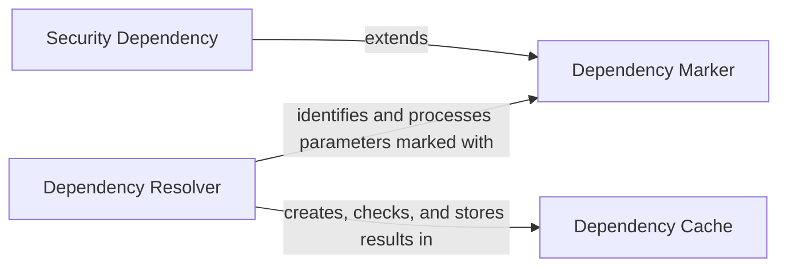

## Details

One paragraph explaining the functionality which is represented by this graph. What the main flow is and what is its purpose.

### Dependency Marker
A declarative class used in path operation function signatures to mark a parameter as a dependency. It acts as a metadata container, holding the reference to the dependency provider (the callable) and configuration options like `use_cache`. It does not execute any logic itself.

**Related Classes/Methods**:

- <a href="https://github.com/fastapi/fastapi/blob/master/fastapi/params.py#L763-L773" target="_blank" rel="noopener noreferrer">`fastapi.params.Depends` (763:773)</a>

### Dependency Resolver
The core engine of the DI system. It introspects the dependency graph (represented by `Dependant` objects), executes the required callables in the correct order, and manages the caching of results. This logic is primarily encapsulated in the `solve_dependencies` function.

**Related Classes/Methods**:

- <a href="https://github.com/fastapi/fastapi/blob/master/fastapi/dependencies/utils.py#L571-L694" target="_blank" rel="noopener noreferrer">`fastapi.dependencies.utils.solve_dependencies` (571:694)</a>

### Dependency Cache
A request-scoped `dict` that stores the results of dependency calls. The `Dependency Resolver` (`solve_dependencies`) creates and manages this cache to retrieve previously computed dependency results within the same request when `use_cache` is enabled. It is not a standalone class but an integral part of the resolution process.

**Related Classes/Methods**:

- <a href="https://github.com/fastapi/fastapi/blob/master/fastapi/dependencies/utils.py#L571-L694" target="_blank" rel="noopener noreferrer">`fastapi.dependencies.utils.solve_dependencies` (571:694)</a>

### Security Dependency
A specialized subclass of the `Depends` marker, designed specifically for implementing security schemes (e.g., OAuth2, API Keys). It functions identically to `Depends` at runtime but provides additional metadata used to generate the OpenAPI security schema, integrating security requirements directly into the API documentation.

**Related Classes/Methods**:

- `fastapi.Security`
- `fastapi.security.oauth2`

### [FAQ](https://github.com/CodeBoarding/GeneratedOnBoardings/tree/main?tab=readme-ov-file#faq)