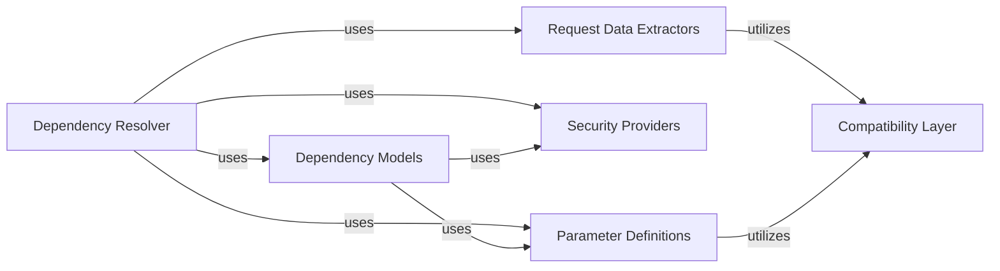

## Details

FastAPI's Dependency Injection (DI) is a cornerstone of its design, promoting modularity, testability, and reusability. It automatically resolves and injects required components into API route functions, streamlining the development of robust and maintainable web services.

### Dependency Resolver
This is the central orchestrator of FastAPI's dependency injection. It analyzes the signatures of path operation functions and their dependencies, recursively resolving all required values from the incoming request. It handles parameter extraction, validation, and the execution of security checks before injecting the resolved values into the callable.

**Related Classes/Methods**:

- <a href="https://github.com/fastapi/fastapi/fastapi/dependencies/utils.py#L571-L694" target="_blank" rel="noopener noreferrer">`fastapi.dependencies.utils:solve_dependencies` (571:694)</a>

### Dependency Models
This component defines the internal data structures used to represent dependencies and security requirements within FastAPI's dependency graph. The `Dependant` class is key, encapsulating all information about a callable dependency, including its parameters, sub-dependencies, and security requirements, forming the blueprint for the resolution process.

**Related Classes/Methods**:

- <a href="https://github.com/fastapi/fastapi/fastapi/dependencies/models.py#L14-L36" target="_blank" rel="noopener noreferrer">`fastapi.dependencies.models:Dependant` (14:36)</a>

### Parameter Definitions
These classes define how different types of parameters (e.g., `Query`, `Path`, `Header`, `Body`, `File`, `Form`, `Cookie`, `Security`) are expected, extracted, and validated from an incoming HTTP request. They provide the metadata and validation rules that the Dependency Resolver uses to understand and process function arguments.

**Related Classes/Methods**:

- <a href="https://github.com/fastapi/fastapi/fastapi/params.py#L224-L305" target="_blank" rel="noopener noreferrer">`fastapi.params:Query` (224:305)</a>
- <a href="https://github.com/fastapi/fastapi/fastapi/params.py#L138-L221" target="_blank" rel="noopener noreferrer">`fastapi.params:Path` (138:221)</a>
- <a href="https://github.com/fastapi/fastapi/fastapi/params.py#L478-L592" target="_blank" rel="noopener noreferrer">`fastapi.params:Body` (478:592)</a>
- <a href="https://github.com/fastapi/fastapi/fastapi/params.py#L763-L773" target="_blank" rel="noopener noreferrer">`fastapi.params:Depends` (763:773)</a>

### Security Providers
These components implement various standard security schemes (e.g., API Key, HTTP Basic/Bearer, OAuth2, OpenID Connect). They are designed to be used as dependencies, allowing FastAPI to integrate authentication and authorization directly into the dependency injection flow, ensuring secure API endpoints.

**Related Classes/Methods**:

- <a href="https://github.com/fastapi/fastapi/fastapi/security/base.py#L1-L1" target="_blank" rel="noopener noreferrer">`fastapi.security.base` (1:1)</a>
- <a href="https://github.com/fastapi/fastapi/fastapi/security/api_key.py#L1-L1" target="_blank" rel="noopener noreferrer">`fastapi.security.api_key` (1:1)</a>
- <a href="https://github.com/fastapi/fastapi/fastapi/security/http.py#L1-L1" target="_blank" rel="noopener noreferrer">`fastapi.security.http` (1:1)</a>
- <a href="https://github.com/fastapi/fastapi/fastapi/security/oauth2.py#L1-L1" target="_blank" rel="noopener noreferrer">`fastapi.security.oauth2` (1:1)</a>
- <a href="https://github.com/fastapi/fastapi/fastapi/security/open_id_connect_url.py#L1-L1" target="_blank" rel="noopener noreferrer">`fastapi.security.open_id_connect_url` (1:1)</a>

### Request Data Extractors
A specialized set of functions, primarily within `fastapi.dependencies.utils`, dedicated to parsing and validating data from different parts of the HTTP request, such as query parameters, path parameters, and the request body (including JSON and form data). These functions are specialized helpers for the Dependency Resolver.

**Related Classes/Methods**:

- <a href="https://github.com/fastapi/fastapi/fastapi/dependencies/utils.py#L929-L979" target="_blank" rel="noopener noreferrer">`fastapi.dependencies.utils:get_body_field` (929:979)</a>
- <a href="https://github.com/fastapi/fastapi/fastapi/dependencies/utils.py#L1-L1" target="_blank" rel="noopener noreferrer">`fastapi.dependencies.utils:get_param_field` (1:1)</a>

### Compatibility Layer
This module provides utility functions and abstractions to ensure FastAPI's compatibility across different Python versions and variations in underlying libraries like Pydantic. It handles differences in how model fields, type annotations, and errors are managed, providing a consistent interface for other components, especially during dependency resolution and data validation.

**Related Classes/Methods**:

- <a href="https://github.com/fastapi/fastapi/fastapi/_compat.py#L1-L1" target="_blank" rel="noopener noreferrer">`fastapi._compat` (1:1)</a>

### [FAQ](https://github.com/CodeBoarding/GeneratedOnBoardings/tree/main?tab=readme-ov-file#faq)