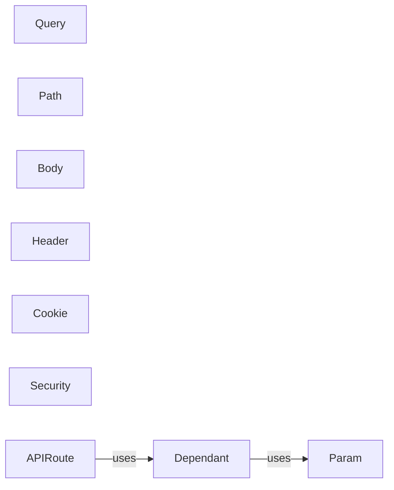

## Details

This subsystem is responsible for managing and injecting dependencies into route handlers (endpoint functions) within the FastAPI application. It ensures that the necessary resources and services are available to each endpoint, promoting modularity, testability, and maintainability.

### Dependant
Represents a dependency that needs to be resolved and injected into a route handler. It encapsulates information about the dependency type, its parameters, and any security requirements.

**Related Classes/Methods**:

- <a href="https://github.com/fastapi/fastapi/blob/master/temp/fastapi/dependencies/models.py" target="_blank" rel="noopener noreferrer">`fastapi.dependencies.models` (0:0)</a>

### Param
Base class for defining request parameters (query, path, header, cookie, etc.) and dependencies.

**Related Classes/Methods**:

- <a href="https://github.com/fastapi/fastapi/blob/master/temp/fastapi/params.py" target="_blank" rel="noopener noreferrer">`fastapi.params` (0:0)</a>

### Query
Defines query parameters for request handlers.

**Related Classes/Methods**:

- <a href="https://github.com/fastapi/fastapi/blob/master/temp/fastapi/params.py" target="_blank" rel="noopener noreferrer">`fastapi.params` (0:0)</a>

### Path
Defines path parameters for request handlers.

**Related Classes/Methods**:

- <a href="https://github.com/fastapi/fastapi/blob/master/temp/fastapi/params.py" target="_blank" rel="noopener noreferrer">`fastapi.params` (0:0)</a>

### Body
Defines request body parameters for request handlers.

**Related Classes/Methods**:

- <a href="https://github.com/fastapi/fastapi/blob/master/temp/fastapi/params.py" target="_blank" rel="noopener noreferrer">`fastapi.params` (0:0)</a>

### Header
Defines header parameters for request handlers.

**Related Classes/Methods**:

- <a href="https://github.com/fastapi/fastapi/blob/master/temp/fastapi/params.py" target="_blank" rel="noopener noreferrer">`fastapi.params` (0:0)</a>

### Cookie
Defines cookie parameters for request handlers.

**Related Classes/Methods**:

- <a href="https://github.com/fastapi/fastapi/blob/master/temp/fastapi/params.py" target="_blank" rel="noopener noreferrer">`fastapi.params` (0:0)</a>

### Security
Defines security dependencies for request handlers.

**Related Classes/Methods**:

- <a href="https://github.com/fastapi/fastapi/blob/master/temp/fastapi/params.py" target="_blank" rel="noopener noreferrer">`fastapi.params` (0:0)</a>

### APIRoute
Represents a route handler in the API. It's responsible for defining the endpoint's path, HTTP method, and the function to be executed.

**Related Classes/Methods**:

- <a href="https://github.com/fastapi/fastapi/blob/master/temp/fastapi/routing.py" target="_blank" rel="noopener noreferrer">`fastapi.routing` (0:0)</a>

### [FAQ](https://github.com/CodeBoarding/GeneratedOnBoardings/tree/main?tab=readme-ov-file#faq)