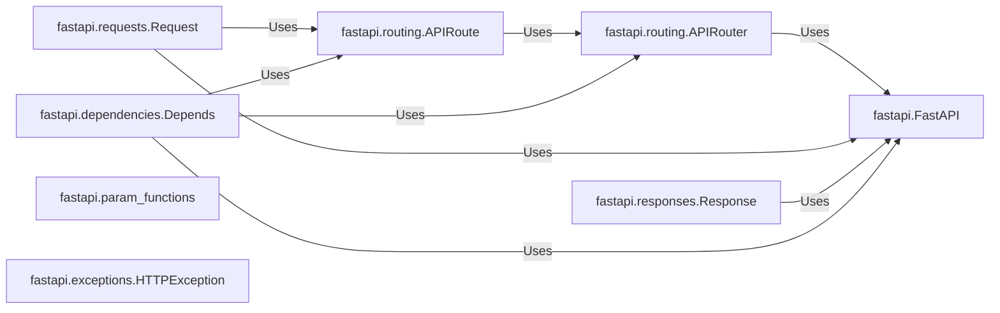

## Details

This component encompasses the functions and related structures that define the behavior of the API endpoints. It's where the application's business logic resides, processing incoming requests and generating appropriate responses.

### fastapi.FastAPI
The central application class. It inherits from `APIRouter` and is the main entry point for defining the API. It's responsible for managing routes, middleware, and exception handling.

**Related Classes/Methods**: _None_

### fastapi.routing.APIRouter
A class for creating modular sets of routes. It allows grouping related endpoints and applying common configurations (e.g., prefix, tags, dependencies).

**Related Classes/Methods**: _None_

### fastapi.routing.APIRoute
Represents a single route (endpoint) in the API. It defines the path, HTTP methods, request/response models, and the actual handler function.

**Related Classes/Methods**: _None_

### fastapi.requests.Request
Represents an incoming HTTP request. It provides access to request headers, body, query parameters, etc.

**Related Classes/Methods**: _None_

### fastapi.responses.Response
Represents an HTTP response. It allows setting the response body, headers, and status code.

**Related Classes/Methods**: _None_

### fastapi.dependencies.Depends
A function used for dependency injection. It allows declaring dependencies that will be resolved and injected into the endpoint handler function.

**Related Classes/Methods**: _None_

### fastapi.param_functions
Defines functions for declaring request parameters (query, path, header, cookie, body).

**Related Classes/Methods**: _None_

### fastapi.exceptions.HTTPException
A custom exception class for FastAPI, used to raise HTTP exceptions with specific status codes and error messages.

**Related Classes/Methods**: _None_

### [FAQ](https://github.com/CodeBoarding/GeneratedOnBoardings/tree/main?tab=readme-ov-file#faq)