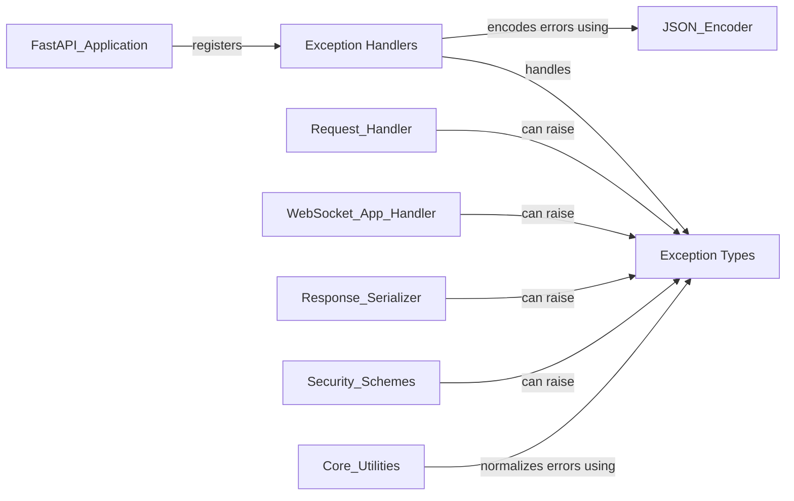

## Component Details

The Exception & Error Handling subsystem in FastAPI is crucial for managing various application errors and presenting them to clients in a standardized manner. It defines a hierarchy of exception types, including HTTP-specific errors and validation failures, and provides dedicated handlers to catch these exceptions. These handlers then transform the raw exceptions into structured HTTP or WebSocket error responses, ensuring consistent error reporting across the API. This subsystem integrates with the core application flow, allowing different components to raise specific exceptions that are then gracefully handled and serialized into client-friendly formats.

### Exception Types
Defines various exception classes used within FastAPI to signal different types of errors, including HTTP errors, request validation failures, response validation failures, and WebSocket errors.

**Related Classes/Methods**:

- <a href="https://github.com/fastapi/fastapi/blob/master/fastapi/exceptions.py#L9-L65" target="_blank" rel="noopener noreferrer">`fastapi.exceptions.HTTPException` (9:65)</a>
- <a href="https://github.com/fastapi/fastapi/blob/master/fastapi/exceptions.py#L157-L160" target="_blank" rel="noopener noreferrer">`fastapi.exceptions.RequestValidationError` (157:160)</a>
- <a href="https://github.com/fastapi/fastapi/blob/master/fastapi/exceptions.py#L163-L164" target="_blank" rel="noopener noreferrer">`fastapi.exceptions.WebSocketRequestValidationError` (163:164)</a>
- <a href="https://github.com/fastapi/fastapi/blob/master/fastapi/exceptions.py#L167-L176" target="_blank" rel="noopener noreferrer">`fastapi.exceptions.ResponseValidationError` (167:176)</a>
- <a href="https://github.com/fastapi/fastapi/blob/master/fastapi/exceptions.py#L68-L136" target="_blank" rel="noopener noreferrer">`fastapi.exceptions.WebSocketException` (68:136)</a>
- <a href="https://github.com/fastapi/fastapi/blob/master/fastapi/exceptions.py#L149-L154" target="_blank" rel="noopener noreferrer">`fastapi.exceptions.ValidationException` (149:154)</a>

### Exception Handlers
Provides default and customizable handlers for converting various exceptions into standardized HTTP or WebSocket error responses.

**Related Classes/Methods**:

- <a href="https://github.com/fastapi/fastapi/blob/master/fastapi/exception_handlers.py#L11-L17" target="_blank" rel="noopener noreferrer">`fastapi.exception_handlers.http_exception_handler` (11:17)</a>
- <a href="https://github.com/fastapi/fastapi/blob/master/fastapi/exception_handlers.py#L20-L26" target="_blank" rel="noopener noreferrer">`fastapi.exception_handlers.request_validation_exception_handler` (20:26)</a>
- <a href="https://github.com/fastapi/fastapi/blob/master/fastapi/exception_handlers.py#L29-L34" target="_blank" rel="noopener noreferrer">`fastapi.exception_handlers.websocket_request_validation_exception_handler` (29:34)</a>

### [FAQ](https://github.com/CodeBoarding/GeneratedOnBoardings/tree/main?tab=readme-ov-file#faq)