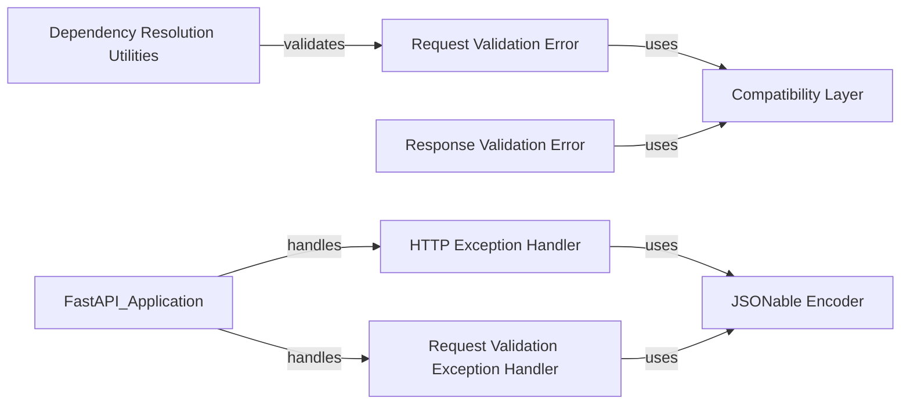

## Component Details

The Exception Handling and Data Validation subsystem in FastAPI is responsible for ensuring that errors, both from the application logic and from invalid user input, are handled gracefully and consistently. It provides mechanisms to catch and process exceptions, converting them into appropriate HTTP responses. This includes handling standard HTTP exceptions, as well as validation errors that arise when request data does not conform to the expected schema. The subsystem relies on Pydantic for data validation and uses custom exception handlers to format error details into JSON responses, providing informative feedback to the client.

### HTTP Exception Handler
Handles HTTP exceptions by formatting the exception information into a JSON response. It uses `jsonable_encoder` to encode the exception details, ensuring that the response is JSON-serializable.
- **Related Classes/Methods**:

['[`fastapi.exception_handlers.http_exception_handler` (11:17)](https://github.com/fastapi/fastapi/blob/master/fastapi/exception_handlers.py#L11-L17)']

### Request Validation Exception Handler
Handles request validation errors, which occur when the data provided in a request does not match the expected schema. It formats the exception information into a JSON response, providing details about the validation errors. It uses `jsonable_encoder` to encode the exception details.
- **Related Classes/Methods**:

['[`fastapi.exception_handlers.request_validation_exception_handler` (20:26)](https://github.com/fastapi/fastapi/blob/master/fastapi/exception_handlers.py#L20-L26)']

### Request Validation Error
Represents validation errors that occur during request processing. It inherits from ValidationException and provides specific error messages and details about the validation failures. It leverages the compatibility layer for handling different Pydantic versions.
- **Related Classes/Methods**:

['[`fastapi.exceptions.RequestValidationError` (157:160)](https://github.com/fastapi/fastapi/blob/master/fastapi/exceptions.py#L157-L160)']

### Response Validation Error
Represents validation errors that occur during response processing, ensuring that the data returned by an endpoint conforms to the defined schema. It inherits from ValidationException and provides specific error messages and details. It leverages the compatibility layer for handling different Pydantic versions.
- **Related Classes/Methods**:

['[`fastapi.exceptions.ResponseValidationError` (167:176)](https://github.com/fastapi/fastapi/blob/master/fastapi/exceptions.py#L167-L176)']

### JSONable Encoder
Encodes data into a JSON-compatible format. It is used by the exception handlers to encode exception details, ensuring that complex data structures can be serialized into JSON for error responses.
- **Related Classes/Methods**:

['[`fastapi.encoders.jsonable_encoder` (102:343)](https://github.com/fastapi/fastapi/blob/master/fastapi/encoders.py#L102-L343)']

### Dependency Resolution Utilities
Provides utility functions for resolving dependencies, including validating values against defined parameters (Path, Query, Body, etc.). It interacts with the parameter classes to extract dependency information and validate the request data, raising RequestValidationErrors when necessary.
- **Related Classes/Methods**:

['[`fastapi.dependencies.utils:get_dependant` (265:314)](https://github.com/fastapi/fastapi/blob/master/fastapi/dependencies/utils.py#L265-L314)', '[`fastapi.dependencies.utils:analyze_param` (348:511)](https://github.com/fastapi/fastapi/blob/master/fastapi/dependencies/utils.py#L348-L511)', '[`fastapi.dependencies.utils:solve_dependencies` (572:695)](https://github.com/fastapi/fastapi/blob/master/fastapi/dependencies/utils.py#L572-L695)', '[`fastapi.dependencies.utils:_validate_value_with_model_field` (698:713)](https://github.com/fastapi/fastapi/blob/master/fastapi/dependencies/utils.py#L698-L713)', '[`fastapi.dependencies.utils:request_params_to_args` (740:816)](https://github.com/fastapi/fastapi/blob/master/fastapi/dependencies/utils.py#L740-L816)', '[`fastapi.dependencies.utils:request_body_to_args` (884:927)](https://github.com/fastapi/fastapi/blob/master/fastapi/dependencies/utils.py#L884-L927)', '[`fastapi.dependencies.utils:get_body_field` (930:980)](https://github.com/fastapi/fastapi/blob/master/fastapi/dependencies/utils.py#L930-L980)']

### Compatibility Layer
Provides compatibility functions for different versions of Pydantic, including normalizing errors and regenerating error locations. It is used by the validation exception handlers to ensure compatibility with different Pydantic versions, allowing FastAPI to function correctly with a range of Pydantic releases.
- **Related Classes/Methods**:

['[`fastapi._compat:_regenerate_error_with_loc` (529:537)](https://github.com/fastapi/fastapi/blob/master/fastapi/_compat.py#L529-L537)']