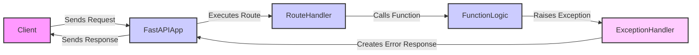

## Exception Handling in FastAPI

This document describes the exception handling mechanism in FastAPI, focusing on how exceptions are caught and transformed into appropriate HTTP responses.

### Data Flow Diagram

### Component Descriptions

*   **Client**: Initiates the request to the FastAPI application.
    *   *Interaction*: Sends HTTP requests and receives HTTP responses.

*   **FastAPIApp**: The core FastAPI application instance.
    *   *Functionality*: Receives requests, routes them to appropriate handlers, and sends responses. It also manages the exception handling process.
    *   *Interaction*: Receives requests from the Client and sends responses back. It also calls the RouteHandler and ExceptionHandler.
    *   *Relevant source files*: `fastapi.applications.FastAPI`

*   **RouteHandler**: Handles the execution of a specific route.
    *   *Functionality*: Executes the function associated with a route.
    *   *Interaction*: Called by FastAPIApp to execute a route. Calls FunctionLogic.

*   **FunctionLogic**: Contains the core logic of a route.
    *   *Functionality*: Performs the main operations of a route, which may raise exceptions.
    *   *Interaction*: Called by RouteHandler. May raise exceptions that are caught by the ExceptionHandler.

*   **ExceptionHandler**: Intercepts exceptions and generates appropriate error responses.
    *   *Functionality*: Catches exceptions raised during request processing and uses registered exception handlers to create error responses.
    *   *Interaction*: Receives exceptions from FunctionLogic. Sends error responses to FastAPIApp.
    *   *Relevant source files*: `fastapi.exception_handlers.http_exception_handler`, `fastapi.exception_handlers.request_validation_exception_handler`
