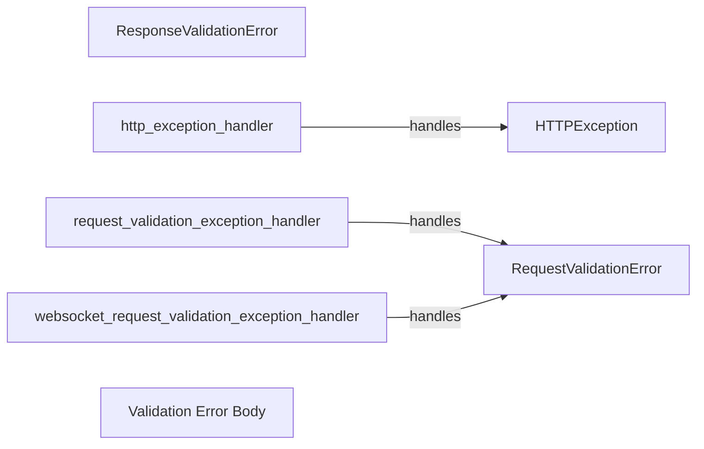

## Component Details

The exception handling component in FastAPI provides a structured way to manage errors that occur during request processing. It defines base exception classes like `HTTPException`, `RequestValidationError`, and `ResponseValidationError` for common error scenarios. FastAPI includes default exception handlers for these exceptions, which format the errors into appropriate JSON responses. Developers can also define custom exception handlers to handle specific exceptions or to customize the error response format. The exception handling mechanism ensures that errors are handled gracefully and that clients receive informative error messages.

### HTTPException
Represents an HTTP exception with a specific status code and detail message. It's used to raise HTTP-related errors within the application.
- **Related Classes/Methods**: `fastapi/exceptions.py`

### RequestValidationError
Represents an exception raised when the incoming request data fails validation. It contains details about the validation errors, such as the field that failed validation and the error message.
- **Related Classes/Methods**: `fastapi/exceptions.py`

### ResponseValidationError
Represents an exception raised when the outgoing response data fails validation. It contains details about the validation errors.
- **Related Classes/Methods**: `fastapi/exceptions.py`

### http_exception_handler
A default exception handler for HTTPException exceptions. It formats the exception into a JSON response with the appropriate status code and detail message.
- **Related Classes/Methods**: `fastapi/exception_handlers.py`

### request_validation_exception_handler
A default exception handler for RequestValidationError exceptions. It formats the validation errors into a JSON response with a 422 status code.
- **Related Classes/Methods**: `fastapi/exception_handlers.py`

### websocket_request_validation_exception_handler
A default exception handler for RequestValidationError exceptions in WebSocket requests. It closes the WebSocket connection with a 422 status code and sends the validation errors.
- **Related Classes/Methods**: `fastapi/exception_handlers.py`

### Validation Error Body
Represents the structure of the validation error body returned in the response. It includes a list of errors, each containing the location, message, and error type.
- **Related Classes/Methods**: `fastapi/exception_handlers.py`
