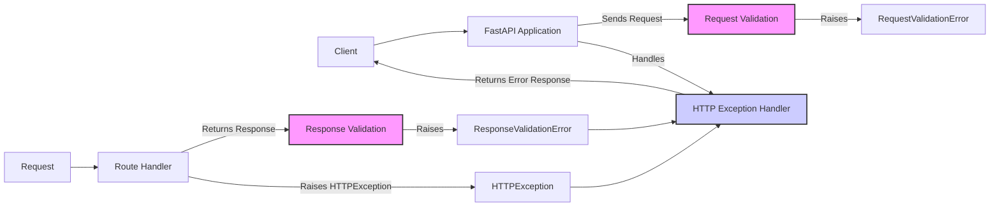

## Exception Handling Flow

### Component Descriptions:

**1. FastAPI Application**
   - *Description*: The main FastAPI application that receives client requests and routes them to the appropriate handlers. It also handles exceptions raised during request processing.
   - *Functionality*: Receives requests, routes them, and handles exceptions.
   - *Interactions*: Receives requests from the client, sends requests to Request Validation, and uses the HTTP Exception Handler.
   - *Relevant source files*: N/A (This is the overall application)

**2. Request Validation**
   - *Description*: Validates the incoming request data against the expected schema.
   - *Functionality*: Checks if the request data is valid.
   - *Interactions*: Receives requests from the FastAPI Application and raises RequestValidationError if validation fails.
   - *Relevant source files*:  N/A (Handled internally by FastAPI)

**3. RequestValidationError**
   - *Description*: An exception raised when request validation fails.
   - *Functionality*: Represents a request validation error.
   - *Interactions*: Raised by Request Validation and handled by the HTTP Exception Handler.
   - *Relevant source files*: `fastapi.exceptions.RequestValidationError`

**4. Route Handler**
    - *Description*: Processes the validated request and returns a response.
    - *Functionality*: Executes the application logic.
    - *Interactions*: Receives validated requests, returns responses to Response Validation, and can raise HTTPExceptions.
    - *Relevant source files*: N/A (This is application-specific)

**5. Response Validation**
    - *Description*: Validates the outgoing response data against the expected schema.
    - *Functionality*: Checks if the response data is valid.
    - *Interactions*: Receives responses from the Route Handler and raises ResponseValidationError if validation fails.
    - *Relevant source files*: N/A (Handled internally by FastAPI)

**6. ResponseValidationError**
    - *Description*: An exception raised when response validation fails.
    - *Functionality*: Represents a response validation error.
    - *Interactions*: Raised by Response Validation and handled by the HTTP Exception Handler.
    - *Relevant source files*: `fastapi.exceptions.ResponseValidationError`

**7. HTTPException**
    - *Description*: An exception that represents an HTTP error with a specific status code and detail.
    - *Functionality*: Represents an HTTP exception.
    - *Interactions*: Raised by the Route Handler and handled by the HTTP Exception Handler.
    - *Relevant source files*: N/A (Part of `starlette.exceptions` which FastAPI uses)

**8. HTTP Exception Handler**
    - *Description*: Handles HTTP exceptions and validation errors by returning a JSON response with the error details and the corresponding HTTP status code.
    - *Functionality*: Converts exceptions into appropriate HTTP responses.
    - *Interactions*: Handles RequestValidationErrors, ResponseValidationErrors, and HTTPExceptions, and returns error responses to the client.
    - *Relevant source files*: `fastapi.exception_handlers.http_exception_handler`
