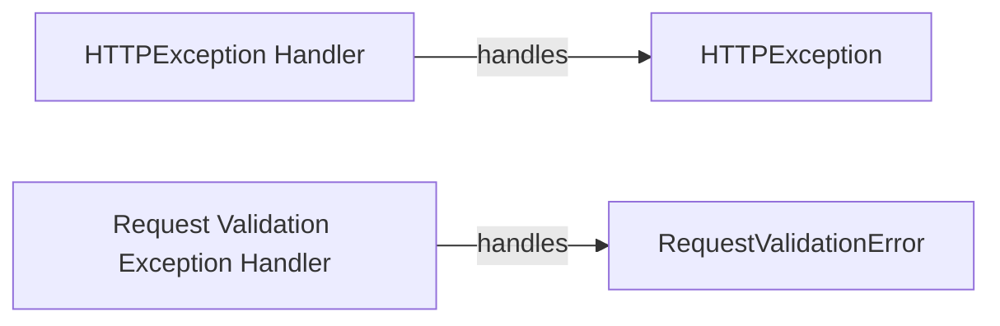

## Component Details

The Exception Management component in FastAPI provides a structured way to handle exceptions that occur during request processing. It includes default exception handlers for common scenarios like HTTP exceptions and request validation errors. These handlers ensure that errors are caught, logged, and transformed into appropriate HTTP responses, providing informative feedback to the client. The component also allows for customization, enabling developers to define specific exception handling logic for different error types or application requirements. This ensures that the application remains stable and provides a consistent user experience even when errors occur.

### HTTPException Handler
Handles HTTP exceptions by returning an appropriate HTTP response with the specified status code and detail. It is the default handler for HTTPException exceptions.
- **Related Classes/Methods**:

- <a href="https://github.com/fastapi/fastapi/blob/master/fastapi/exception_handlers.py#L11-L17" target="_blank" rel="noopener noreferrer">`fastapi.exception_handlers.http_exception_handler` (11:17)</a>

### Request Validation Exception Handler
Handles request validation errors, which occur when the data provided in a request does not conform to the expected schema. It returns an HTTP response with a 422 status code and details about the validation errors.
- **Related Classes/Methods**:

- <a href="https://github.com/fastapi/fastapi/blob/master/fastapi/exception_handlers.py#L20-L26" target="_blank" rel="noopener noreferrer">`fastapi.exception_handlers.request_validation_exception_handler` (20:26)</a>

### RequestValidationError
Represents an error that occurs during request validation. It contains information about the specific validation errors that occurred.
- **Related Classes/Methods**:

- <a href="https://github.com/fastapi/fastapi/blob/master/fastapi/exceptions.py#L158-L160" target="_blank" rel="noopener noreferrer">`fastapi.exceptions.RequestValidationError:__init__` (158:160)</a>

### HTTPException
Represents an HTTP exception with a specific status code and detail. It can be raised to return an error response with the specified status code.
- **Related Classes/Methods**:

- <a href="https://github.com/fastapi/fastapi/blob/master/fastapi/exceptions.py#L9-L65" target="_blank" rel="noopener noreferrer">`fastapi.exceptions.HTTPException` (9:65)</a>