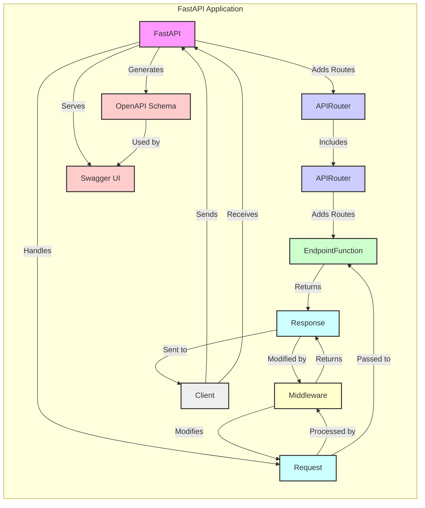

```mermaid
graph LR
    subgraph FastAPI Application
        FastAPI[FastAPI] -- Adds Routes --> APIRouter
        APIRouter -- Includes --> APIRouter2[APIRouter]
        APIRouter2 -- Adds Routes --> EndpointFunction
        FastAPI -- Generates --> OpenAPI[OpenAPI Schema]
        FastAPI -- Serves --> SwaggerUI[Swagger UI]
        FastAPI -- Handles --> Request[Request]
        Request -- Processed by --> Middleware[Middleware]
        Middleware -- Modifies --> Request
        Request -- Passed to --> EndpointFunction
        EndpointFunction -- Returns --> Response[Response]
        Response -- Modified by --> Middleware
        Middleware -- Returns --> Response
        Response -- Sent to --> Client
    end

    Client[Client] -- Sends --> FastAPI
    Client -- Receives --> FastAPI
    OpenAPI -- Used by --> SwaggerUI

    style FastAPI fill:#f9f,stroke:#333,stroke-width:2px
    style APIRouter fill:#ccf,stroke:#333,stroke-width:2px
    style APIRouter2 fill:#ccf,stroke:#333,stroke-width:2px
    style EndpointFunction fill:#cfc,stroke:#333,stroke-width:2px
    style OpenAPI fill:#fcc,stroke:#333,stroke-width:2px
    style SwaggerUI fill:#fcc,stroke:#333,stroke-width:2px
    style Request fill:#cff,stroke:#333,stroke-width:2px
    style Response fill:#cff,stroke:#333,stroke-width:2px
    style Middleware fill:#ffc,stroke:#333,stroke-width:2px
    style Client fill:#eee,stroke:#333,stroke-width:2px

```

