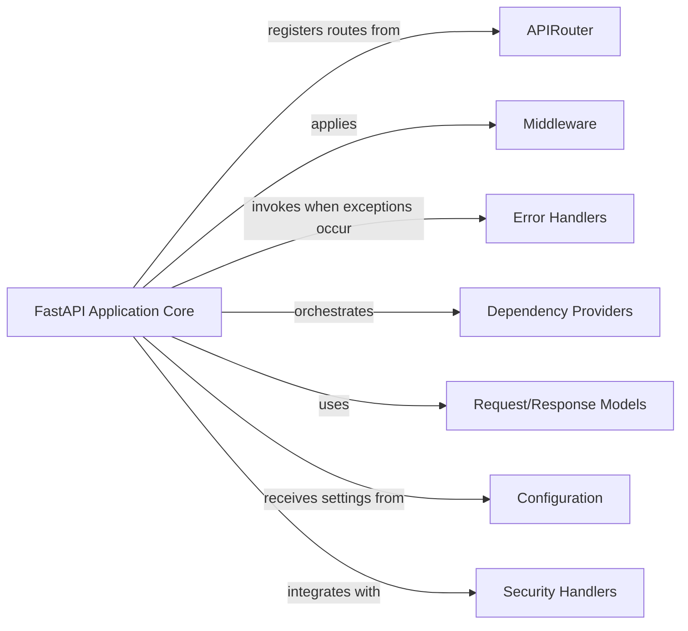

## Details

The FastAPI application is structured around a central `FastAPI Application Core` that orchestrates the entire request-response lifecycle. It integrates `APIRouter` instances to modularize API endpoints, applies `Middleware` for cross-cutting concerns like authentication and logging, and utilizes `Error Handlers` to manage exceptions gracefully. `Dependency Providers` are crucial for injecting reusable logic and resources into route handlers, promoting a clean and testable codebase. Data validation and serialization are handled by `Request/Response Models`, typically defined using Pydantic, ensuring data integrity. Application settings are managed by `Configuration` components, often leveraging Pydantic's `BaseSettings`. Finally, `Security Handlers` are integrated, frequently as dependency providers, to enforce authentication and authorization policies, safeguarding API access. This modular design allows for scalable and maintainable API development.

### FastAPI Application Core [[Expand]](./FastAPI_Application_Core.md)
The primary application instance, responsible for setting up the ASGI application, managing the routing table, applying global middleware, and orchestrating the dependency injection system. It is the central hub through which all requests are processed.

**Related Classes/Methods**:

- <a href="https://github.com/fastapi/fastapi/blob/master/fastapi/applications.py#L48-L4588" target="_blank" rel="noopener noreferrer">`fastapi.applications.FastAPI`:48-4588</a>

### APIRouter
Groups related API endpoints for modularity, allowing for better organization of routes and their associated handlers.

**Related Classes/Methods**:

- <a href="https://github.com/fastapi/fastapi/blob/master/fastapi/routing.py#L596-L4440" target="_blank" rel="noopener noreferrer">`fastapi.routing.APIRouter`:596-4440</a>

### Middleware
Wraps the request-response cycle to process requests and responses, enabling cross-cutting concerns like authentication, logging, or data transformation before or after route handling. While `fastapi.middleware.Middleware` is a conceptual class for defining middleware, specific middleware implementations (e.g., `starlette.middleware.cors.CORSMiddleware`) are typically used.

**Related Classes/Methods**:

- <a href="https://github.com/fastapi/fastapi/blob/master/" target="_blank" rel="noopener noreferrer">`starlette.middleware.Middleware`</a>

### Error Handlers
Provides custom responses for exceptions, allowing the application to gracefully handle errors and return meaningful feedback to clients. These are registered with the FastAPI application.

**Related Classes/Methods**:

- <a href="https://github.com/fastapi/fastapi/blob/master/" target="_blank" rel="noopener noreferrer">`fastapi.applications.FastAPI.add_exception_handler`</a>

### Dependency Providers
Injects reusable logic or resources into route handlers, promoting modularity, reusability, and testability by managing external services, database connections, or common utilities.

**Related Classes/Methods**:

- <a href="https://github.com/fastapi/fastapi/blob/master/fastapi/params.py#L764-L774" target="_blank" rel="noopener noreferrer">`fastapi.params.Depends`:764-774</a>

### Configuration
Provides settings to customize application behavior, such as database connections, API keys, or environment-specific variables, often leveraging Pydantic's `BaseSettings` for validation and loading.

**Related Classes/Methods**:

- <a href="https://github.com/fastapi/fastapi/blob/master/" target="_blank" rel="noopener noreferrer">`pydantic_settings.BaseSettings`</a>

### Request/Response Models
Used for data validation and serialization within routes and dependencies, ensuring that incoming data conforms to expected schemas and outgoing data is properly formatted, typically using Pydantic models.

**Related Classes/Methods**:

- <a href="https://github.com/fastapi/fastapi/blob/master/" target="_blank" rel="noopener noreferrer">`pydantic.BaseModel`</a>

### Security Handlers
Handles authentication and authorization, often implemented as dependency providers, to protect API endpoints and control access based on user roles or credentials.

**Related Classes/Methods**:

- <a href="https://github.com/fastapi/fastapi/blob/master/fastapi/security/oauth2.py#L391-L500" target="_blank" rel="noopener noreferrer">`fastapi.security.oauth2.OAuth2PasswordBearer`:391-500</a>

### [FAQ](https://github.com/CodeBoarding/GeneratedOnBoardings/tree/main?tab=readme-ov-file#faq)