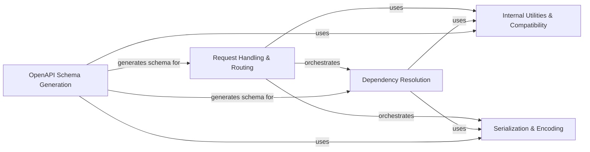

## Component Details

This graph illustrates the core components of FastAPI, detailing their responsibilities and interactions. The main flow encompasses the processing of incoming requests, resolution of dependencies, serialization of responses, generation of OpenAPI schema for documentation, and the underlying internal utilities and compatibility layers that ensure smooth operation across different Pydantic versions and provide essential helper functions.

### Request Handling & Routing
This component is responsible for processing incoming HTTP requests, orchestrating the flow from request reception to response generation. It includes the core logic for handling API routes, executing endpoint functions, and serializing responses.

**Related Classes/Methods**:

- <a href="https://github.com/fastapi/fastapi/blob/master/fastapi/routing.py#L217-L357" target="_blank" rel="noopener noreferrer">`fastapi.fastapi.routing:get_request_handler` (217:357)</a>
- <a href="https://github.com/fastapi/fastapi/blob/master/fastapi/routing.py#L429-L569" target="_blank" rel="noopener noreferrer">`fastapi.fastapi.routing.APIRoute:__init__` (429:569)</a>
- <a href="https://github.com/fastapi/fastapi/blob/master/fastapi/routing.py#L881-L961" target="_blank" rel="noopener noreferrer">`fastapi.fastapi.routing.APIRouter:add_api_route` (881:961)</a>
- <a href="https://github.com/fastapi/fastapi/blob/master/fastapi/routing.py#L204-L214" target="_blank" rel="noopener noreferrer">`fastapi.fastapi.routing.run_endpoint_function` (204:214)</a>
- <a href="https://github.com/fastapi/fastapi/blob/master/fastapi/routing.py#L143-L201" target="_blank" rel="noopener noreferrer">`fastapi.fastapi.routing.serialize_response` (143:201)</a>
- <a href="https://github.com/fastapi/fastapi/blob/master/fastapi/routing.py#L79-L123" target="_blank" rel="noopener noreferrer">`fastapi.fastapi.routing:_prepare_response_content` (79:123)</a>

### Dependency Resolution
This component manages the resolution of dependencies for API endpoints. It analyzes function signatures, identifies parameters (path, query, header, cookie, body), and recursively resolves any nested dependencies, ensuring that the endpoint receives all necessary inputs.

**Related Classes/Methods**:

- <a href="https://github.com/fastapi/fastapi/blob/master/fastapi/dependencies/utils.py#L572-L695" target="_blank" rel="noopener noreferrer">`fastapi.fastapi.dependencies.utils.solve_dependencies` (572:695)</a>
- <a href="https://github.com/fastapi/fastapi/blob/master/fastapi/dependencies/utils.py#L265-L314" target="_blank" rel="noopener noreferrer">`fastapi.fastapi.dependencies.utils.get_dependant` (265:314)</a>
- <a href="https://github.com/fastapi/fastapi/blob/master/fastapi/dependencies/utils.py#L348-L511" target="_blank" rel="noopener noreferrer">`fastapi.fastapi.dependencies.utils.analyze_param` (348:511)</a>
- <a href="https://github.com/fastapi/fastapi/blob/master/fastapi/dependencies/utils.py#L740-L816" target="_blank" rel="noopener noreferrer">`fastapi.fastapi.dependencies.utils.request_params_to_args` (740:816)</a>
- <a href="https://github.com/fastapi/fastapi/blob/master/fastapi/dependencies/utils.py#L884-L927" target="_blank" rel="noopener noreferrer">`fastapi.fastapi.dependencies.utils.request_body_to_args` (884:927)</a>
- <a href="https://github.com/fastapi/fastapi/blob/master/fastapi/dependencies/utils.py#L930-L980" target="_blank" rel="noopener noreferrer">`fastapi.fastapi.dependencies.utils.get_body_field` (930:980)</a>
- <a href="https://github.com/fastapi/fastapi/blob/master/fastapi/dependencies/utils.py#L212-L219" target="_blank" rel="noopener noreferrer">`fastapi.fastapi.dependencies.utils._get_flat_fields_from_params` (212:219)</a>
- <a href="https://github.com/fastapi/fastapi/blob/master/fastapi/dependencies/utils.py#L177-L209" target="_blank" rel="noopener noreferrer">`fastapi.fastapi.dependencies.utils.get_flat_dependant` (177:209)</a>
- <a href="https://github.com/fastapi/fastapi/blob/master/fastapi/dependencies/utils.py#L698-L713" target="_blank" rel="noopener noreferrer">`fastapi.fastapi.dependencies.utils._validate_value_with_model_field` (698:713)</a>
- <a href="https://github.com/fastapi/fastapi/blob/master/fastapi/dependencies/utils.py#L716-L737" target="_blank" rel="noopener noreferrer">`fastapi.fastapi.dependencies.utils._get_multidict_value` (716:737)</a>
- <a href="https://github.com/fastapi/fastapi/blob/master/fastapi/dependencies/utils.py#L841-L881" target="_blank" rel="noopener noreferrer">`fastapi.fastapi.dependencies.utils._extract_form_body` (841:881)</a>

### Serialization & Encoding
This component handles the conversion of Python objects into JSON-compatible formats for responses. It supports various data types, including Pydantic models, enums, and dates, ensuring proper serialization before sending data to the client.

**Related Classes/Methods**:

- <a href="https://github.com/fastapi/fastapi/blob/master/fastapi/encoders.py#L102-L343" target="_blank" rel="noopener noreferrer">`fastapi.fastapi.encoders:jsonable_encoder` (102:343)</a>
- <a href="https://github.com/fastapi/fastapi/blob/master/fastapi/_compat.py#L172-L173" target="_blank" rel="noopener noreferrer">`fastapi.fastapi._compat._model_dump` (172:173)</a>

### OpenAPI Schema Generation
This component is responsible for generating the OpenAPI schema, which describes the API's structure, endpoints, parameters, request bodies, and responses. This schema is used to power interactive documentation like Swagger UI and ReDoc.

**Related Classes/Methods**:

- <a href="https://github.com/fastapi/fastapi/blob/master/fastapi/openapi/utils.py#L477-L569" target="_blank" rel="noopener noreferrer">`fastapi.fastapi.openapi.utils:get_openapi` (477:569)</a>
- <a href="https://github.com/fastapi/fastapi/blob/master/fastapi/openapi/utils.py#L254-L443" target="_blank" rel="noopener noreferrer">`fastapi.fastapi.openapi.utils:get_openapi_path` (254:443)</a>
- <a href="https://github.com/fastapi/fastapi/blob/master/fastapi/openapi/utils.py#L95-L167" target="_blank" rel="noopener noreferrer">`fastapi.fastapi.openapi.utils:_get_openapi_operation_parameters` (95:167)</a>
- <a href="https://github.com/fastapi/fastapi/blob/master/fastapi/openapi/utils.py#L170-L204" target="_blank" rel="noopener noreferrer">`fastapi.fastapi.openapi.utils:get_openapi_operation_request_body` (170:204)</a>
- <a href="https://github.com/fastapi/fastapi/blob/master/fastapi/openapi/utils.py#L78-L92" target="_blank" rel="noopener noreferrer">`fastapi.fastapi.openapi.utils:get_openapi_security_definitions` (78:92)</a>
- <a href="https://github.com/fastapi/fastapi/blob/master/fastapi/openapi/utils.py#L446-L474" target="_blank" rel="noopener noreferrer">`fastapi.fastapi.openapi.utils:get_fields_from_routes` (446:474)</a>

### Internal Utilities & Compatibility
This component provides internal helper functions, data structures, and compatibility layers that support the core functionality of FastAPI. It specifically handles Pydantic model manipulation, type introspection, error normalization, and abstracts away differences between Pydantic V1 and V2.

**Related Classes/Methods**:

- <a href="https://github.com/fastapi/fastapi/blob/master/fastapi/utils.py#L63-L106" target="_blank" rel="noopener noreferrer">`fastapi.utils.create_model_field` (63:106)</a>
- <a href="https://github.com/fastapi/fastapi/blob/master/fastapi/utils.py#L109-L161" target="_blank" rel="noopener noreferrer">`fastapi.utils.create_cloned_field` (109:161)</a>
- <a href="https://github.com/fastapi/fastapi/blob/master/fastapi/utils.py#L187-L202" target="_blank" rel="noopener noreferrer">`fastapi.utils.deep_dict_update` (187:202)</a>
- <a href="https://github.com/fastapi/fastapi/blob/master/fastapi/utils.py#L205-L220" target="_blank" rel="noopener noreferrer">`fastapi.utils.get_value_or_default` (205:220)</a>
- <a href="https://github.com/fastapi/fastapi/blob/master/fastapi/utils.py#L42-L56" target="_blank" rel="noopener noreferrer">`fastapi.utils.is_body_allowed_for_status_code` (42:56)</a>
- <a href="https://github.com/fastapi/fastapi/blob/master/fastapi/utils.py#L59-L60" target="_blank" rel="noopener noreferrer">`fastapi.utils.get_path_param_names` (59:60)</a>
- <a href="https://github.com/fastapi/fastapi/blob/master/fastapi/utils.py#L179-L184" target="_blank" rel="noopener noreferrer">`fastapi.utils.generate_unique_id` (179:184)</a>
- <a href="https://github.com/fastapi/fastapi/blob/master/fastapi/_compat.py#L1-L500" target="_blank" rel="noopener noreferrer">`fastapi._compat` (1:500)</a>
- <a href="https://github.com/fastapi/fastapi/blob/master/fastapi/_compat.py#L89-L160" target="_blank" rel="noopener noreferrer">`fastapi._compat.ModelField` (89:160)</a>
- <a href="https://github.com/fastapi/fastapi/blob/master/fastapi/_compat.py#L167-L168" target="_blank" rel="noopener noreferrer">`fastapi._compat._normalize_errors` (167:168)</a>
- <a href="https://github.com/fastapi/fastapi/blob/master/fastapi/_compat.py#L172-L173" target="_blank" rel="noopener noreferrer">`fastapi._compat._model_dump` (172:173)</a>
- <a href="https://github.com/fastapi/fastapi/blob/master/fastapi/_compat.py#L170-L171" target="_blank" rel="noopener noreferrer">`fastapi._compat._model_rebuild` (170:171)</a>
- <a href="https://github.com/fastapi/fastapi/blob/master/fastapi/_compat.py#L546-L555" target="_blank" rel="noopener noreferrer">`fastapi._compat.field_annotation_is_sequence` (546:555)</a>
- <a href="https://github.com/fastapi/fastapi/blob/master/fastapi/_compat.py#L583-L585" target="_blank" rel="noopener noreferrer">`fastapi._compat.field_annotation_is_scalar` (583:585)</a>
- <a href="https://github.com/fastapi/fastapi/blob/master/fastapi/_compat.py#L627-L639" target="_blank" rel="noopener noreferrer">`fastapi._compat.is_bytes_sequence_annotation` (627:639)</a>
- <a href="https://github.com/fastapi/fastapi/blob/master/fastapi/_compat.py#L658-L659" target="_blank" rel="noopener noreferrer">`fastapi._compat.get_cached_model_fields` (658:659)</a>
- <a href="https://github.com/fastapi/fastapi/blob/master/fastapi/_compat.py#L238-L242" target="_blank" rel="noopener noreferrer">`fastapi._compat.create_body_model` (238:242)</a>

### [FAQ](https://github.com/CodeBoarding/GeneratedOnBoardings/tree/main?tab=readme-ov-file#faq)