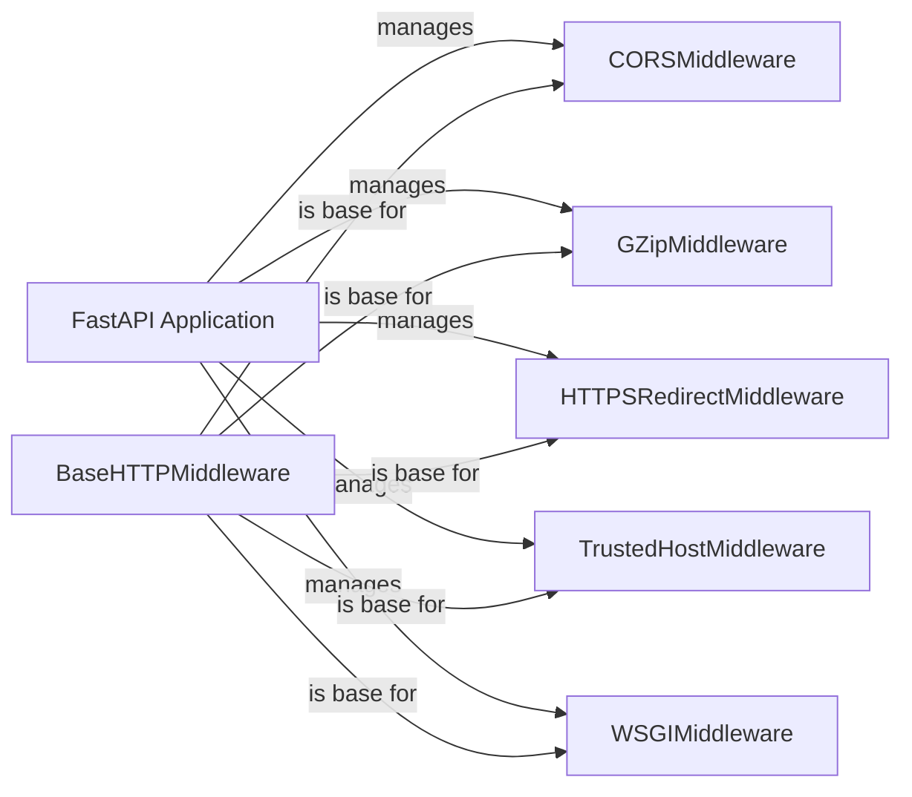

## Component Details

The middleware management in FastAPI provides a flexible and extensible mechanism for intercepting and processing HTTP requests and responses. It allows developers to add custom logic to the request-response cycle, enabling features such as CORS handling, GZip compression, HTTPS redirection, and trusted host validation. The core of this system revolves around the `FastAPI` application instance, which manages a stack of middleware components. Each middleware component, typically inheriting from `BaseHTTPMiddleware`, encapsulates specific request/response processing logic. When a request is received, it passes through the middleware stack in the order they were added to the application. Each middleware can then modify the request or response, or perform other actions, before passing it on to the next middleware or the application's route handler.

### FastAPI Application
The core application class in FastAPI, responsible for creating the application instance and managing the middleware stack. It provides methods for adding middleware to the application.
- **Related Classes/Methods**: `fastapi/fastapi.py`

### BaseHTTPMiddleware
Base class for creating HTTP middleware. It provides a structure for processing requests and responses. All custom middlewares should inherit from this class.
- **Related Classes/Methods**: `fastapi/middleware.py`

### CORSMiddleware
Middleware for handling Cross-Origin Resource Sharing (CORS) requests. It allows configuring which origins, methods, and headers are allowed for cross-origin requests, enhancing security by controlling which external domains can access the application's resources.
- **Related Classes/Methods**: `fastapi/middleware/cors.py`

### GZipMiddleware
Middleware for compressing HTTP responses using GZip. It reduces the size of the response body, improving performance by decreasing the amount of data transferred over the network.
- **Related Classes/Methods**: `fastapi/middleware/gzip.py`

### HTTPSRedirectMiddleware
Middleware for redirecting HTTP requests to HTTPS. It ensures that all traffic is encrypted, enhancing security by preventing eavesdropping and man-in-the-middle attacks.
- **Related Classes/Methods**: `fastapi/middleware/httpsredirect.py`

### TrustedHostMiddleware
Middleware for validating the host header in HTTP requests. It prevents host header injection attacks, enhancing security by ensuring that the application only responds to requests with trusted host headers.
- **Related Classes/Methods**: `fastapi/middleware/trustedhost.py`

### WSGIMiddleware
Middleware for wrapping a WSGI application within a FastAPI application. It allows using existing WSGI applications within FastAPI, providing compatibility with older frameworks and libraries.
- **Related Classes/Methods**: `fastapi/middleware/wsgi.py`
