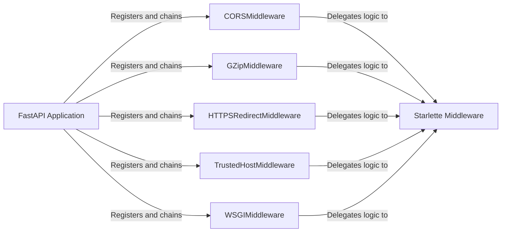

## Details

One paragraph explaining the functionality which is represented by this graph. What the main flow is and what is its purpose.

### FastAPI Application
The central application object that serves as the orchestrator for the middleware chain. It provides the `add_middleware` method, allowing developers to register middleware components into the request/response processing pipeline.

**Related Classes/Methods**:

- `fastapi/applications.py`

### CORSMiddleware
Manages Cross-Origin Resource Sharing (CORS) by intercepting requests and responses to add the necessary HTTP headers (e.g., `Access-Control-Allow-Origin`), enabling browsers to permit requests from different domains.

**Related Classes/Methods**:

- `fastapi/middleware/cors.py`

### GZipMiddleware
Handles response compression. It inspects the `Accept-Encoding` header of incoming requests and, if supported by the client, compresses the response body using GZip to reduce bandwidth usage.

**Related Classes/Methods**:

- `fastapi/middleware/gzip.py`

### HTTPSRedirectMiddleware
Enforces secure connections by automatically redirecting any incoming `http` requests to their `https` equivalent, ensuring all traffic is encrypted.

**Related Classes/Methods**:

- `fastapi/middleware/httpsredirect.py`

### TrustedHostMiddleware
A security component that validates the `Host` header of incoming requests against a predefined list of allowed hostnames. This prevents HTTP Host header attacks by rejecting requests from untrusted domains.

**Related Classes/Methods**:

- `fastapi/middleware/trustedhost.py`

### WSGIMiddleware
An adapter that allows a WSGI application (e.g., Flask, Django) to run within FastAPI's ASGI environment. It translates requests and responses between the two protocols, enabling integration with legacy systems.

**Related Classes/Methods**:

- `fastapi/middleware/wsgi.py`

### Starlette Middleware
The underlying set of ASGI middleware components from the Starlette framework. FastAPI's middleware components are primarily wrappers that re-export and instantiate these foundational Starlette classes, handling the actual logic.

**Related Classes/Methods**:

- `starlette/middleware/*`

### [FAQ](https://github.com/CodeBoarding/GeneratedOnBoardings/tree/main?tab=readme-ov-file#faq)