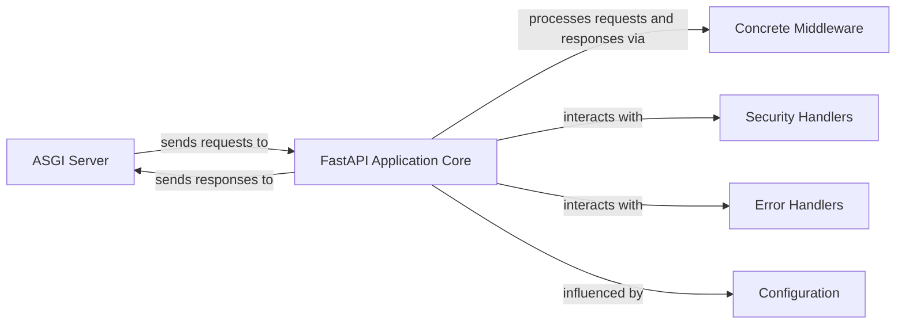

## Details

The subsystem under analysis encompasses the core components of a FastAPI application responsible for handling HTTP requests and responses, including middleware processing, routing, and error management. It excludes external services or databases that the FastAPI application might interact with, focusing solely on the internal request-response pipeline.

### ASGI Server
An Asynchronous Server Gateway Interface (ASGI) server (e.g., Uvicorn) that serves as the primary entry point for all incoming HTTP requests and the final exit point for outgoing responses. It initiates the request processing flow by passing requests to the FastAPI application.

**Related Classes/Methods**: _None_

### FastAPI Application Core [[Expand]](./FastAPI_Application_Core.md)
This component, represented by the `fastapi.applications.FastAPI` class, is the central orchestrator of the application. It initializes and manages the middleware stack, handles routing, dispatches requests to appropriate *path operations*, executes business logic, and prepares responses.

**Related Classes/Methods**:

- <a href="https://github.com/fastapi/fastapi/blob/master/fastapi/applications.py#L48-L4588" target="_blank" rel="noopener noreferrer">`fastapi.applications.FastAPI`:48-4588</a>

### Concrete Middleware
Represents specific middleware implementations (e.g., `fastapi.middleware.cors.CORSMiddleware`) that are part of the application's middleware chain. These components intercept and process requests and responses sequentially, applying cross-cutting concerns like CORS, GZIP compression, or custom logic. They adhere to the abstract middleware interface provided by Starlette (`starlette.middleware.Middleware`).

**Related Classes/Methods**:

- <a href="https://github.com/fastapi/fastapi/blob/master/" target="_blank" rel="noopener noreferrer">`fastapi.middleware.cors.CORSMiddleware`</a>

### Security Handlers
Components responsible for implementing authentication and authorization logic, often integrated as dependencies within *path operations* or via middleware.

**Related Classes/Methods**:

- <a href="https://github.com/fastapi/fastapi/blob/master/fastapi/security/oauth2.py#L391-L500" target="_blank" rel="noopener noreferrer">`fastapi.security.oauth2.OAuth2PasswordBearer`:391-500</a>

### Error Handlers
Components designed to catch and process exceptions that occur during the request-response lifecycle, ensuring consistent error responses and graceful degradation.

**Related Classes/Methods**:

- <a href="https://github.com/fastapi/fastapi/blob/master/fastapi/exception_handlers.py#L11-L17" target="_blank" rel="noopener noreferrer">`fastapi.exception_handlers.http_exception_handler`:11-17</a>

### Configuration
The system responsible for providing application-wide settings and parameters, typically passed during the instantiation of the `FastAPI` application. This influences the behavior and setup of the `FastAPI Application Core` and its integrated components.

**Related Classes/Methods**: _None_

### [FAQ](https://github.com/CodeBoarding/GeneratedOnBoardings/tree/main?tab=readme-ov-file#faq)