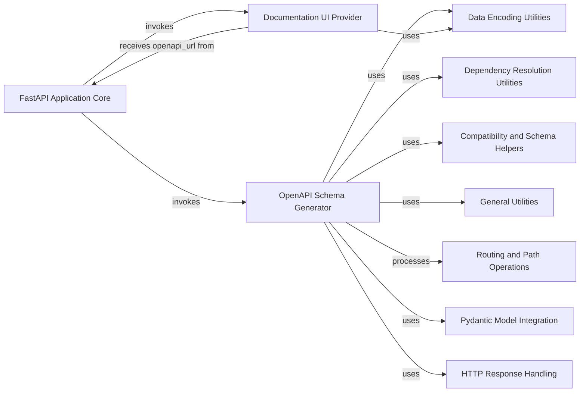

## Component Details

This subsystem is responsible for generating and serving the OpenAPI (Swagger) specification and interactive documentation UIs for a FastAPI application. The FastAPI Application Core orchestrates this process by invoking the OpenAPI Schema Generator to create the API specification from defined routes and models, and then utilizing the Documentation UI Provider to render the interactive Swagger UI and ReDoc pages, making the API discoverable and testable.

### FastAPI Application Core
The central component of a FastAPI application, responsible for initializing the application, managing routes, and setting up OpenAPI documentation endpoints. It orchestrates the generation and serving of the OpenAPI schema and interactive documentation UIs.

**Related Classes/Methods**:

- <a href="https://github.com/fastapi/fastapi/blob/master/fastapi/applications.py#L48-L4585" target="_blank" rel="noopener noreferrer">`fastapi.fastapi.applications.FastAPI` (48:4585)</a>
- <a href="https://github.com/fastapi/fastapi/blob/master/fastapi/applications.py#L966-L996" target="_blank" rel="noopener noreferrer">`fastapi.fastapi.applications.FastAPI.openapi` (966:996)</a>
- <a href="https://github.com/fastapi/fastapi/blob/master/fastapi/applications.py#L998-L1049" target="_blank" rel="noopener noreferrer">`fastapi.fastapi.applications.FastAPI.setup` (998:1049)</a>
- <a href="https://github.com/fastapi/fastapi/blob/master/fastapi/applications.py#L1460-L1831" target="_blank" rel="noopener noreferrer">`fastapi.applications.FastAPI.get` (1460:1831)</a>

### OpenAPI Schema Generator
This component is responsible for generating the OpenAPI schema for the FastAPI application. It gathers information about routes, dependencies, and models to construct a comprehensive OpenAPI definition.

**Related Classes/Methods**:

- <a href="https://github.com/fastapi/fastapi/blob/master/fastapi/openapi/utils.py#L477-L569" target="_blank" rel="noopener noreferrer">`fastapi.openapi.utils.get_openapi` (477:569)</a>
- <a href="https://github.com/fastapi/fastapi/blob/master/fastapi/openapi/utils.py#L78-L92" target="_blank" rel="noopener noreferrer">`fastapi.openapi.utils.get_openapi_security_definitions` (78:92)</a>
- <a href="https://github.com/fastapi/fastapi/blob/master/fastapi/openapi/utils.py#L95-L167" target="_blank" rel="noopener noreferrer">`fastapi.openapi.utils._get_openapi_operation_parameters` (95:167)</a>
- <a href="https://github.com/fastapi/fastapi/blob/master/fastapi/openapi/utils.py#L170-L204" target="_blank" rel="noopener noreferrer">`fastapi.openapi.utils.get_openapi_operation_request_body` (170:204)</a>
- <a href="https://github.com/fastapi/fastapi/blob/master/fastapi/openapi/utils.py#L446-L474" target="_blank" rel="noopener noreferrer">`fastapi.openapi.utils.get_fields_from_routes` (446:474)</a>
- <a href="https://github.com/fastapi/fastapi/blob/master/fastapi/openapi/utils.py#L254-L443" target="_blank" rel="noopener noreferrer">`fastapi.openapi.utils.get_openapi_path` (254:443)</a>
- <a href="https://github.com/fastapi/fastapi/blob/master/fastapi/openapi/utils.py#L228-L251" target="_blank" rel="noopener noreferrer">`fastapi.openapi.utils.get_openapi_operation_metadata` (228:251)</a>
- <a href="https://github.com/fastapi/fastapi/blob/master/fastapi/openapi/models.py#L429-L440" target="_blank" rel="noopener noreferrer">`fastapi.openapi.models.OpenAPI` (429:440)</a>

### Documentation UI Provider
This component provides the HTML content for the interactive API documentation UIs, specifically Swagger UI and ReDoc. It takes the generated OpenAPI schema URL and other configuration to render the documentation.

**Related Classes/Methods**:

- <a href="https://github.com/fastapi/fastapi/blob/master/fastapi/openapi/docs.py#L26-L158" target="_blank" rel="noopener noreferrer">`fastapi.openapi.docs.get_swagger_ui_html` (26:158)</a>
- <a href="https://github.com/fastapi/fastapi/blob/master/fastapi/openapi/docs.py#L161-L253" target="_blank" rel="noopener noreferrer">`fastapi.openapi.docs.get_redoc_html` (161:253)</a>

### Data Encoding Utilities
A utility component responsible for encoding Python objects into JSON-compatible formats, often used during OpenAPI schema generation and response serialization.

**Related Classes/Methods**:

- <a href="https://github.com/fastapi/fastapi/blob/master/fastapi/encoders.py#L102-L343" target="_blank" rel="noopener noreferrer">`fastapi.encoders.jsonable_encoder` (102:343)</a>

### Dependency Resolution Utilities
This component handles the flattening and processing of dependencies and parameters defined in path operations, which is crucial for generating accurate OpenAPI schema details.

**Related Classes/Methods**:

- <a href="https://github.com/fastapi/fastapi/blob/master/fastapi/dependencies/utils.py#L177-L209" target="_blank" rel="noopener noreferrer">`fastapi.dependencies.utils.get_flat_dependant` (177:209)</a>
- <a href="https://github.com/fastapi/fastapi/blob/master/fastapi/dependencies/utils.py#L212-L219" target="_blank" rel="noopener noreferrer">`fastapi.dependencies.utils._get_flat_fields_from_params` (212:219)</a>
- <a href="https://github.com/fastapi/fastapi/blob/master/fastapi/dependencies/utils.py#L222-L228" target="_blank" rel="noopener noreferrer">`fastapi.dependencies.utils.get_flat_params` (222:228)</a>

### Compatibility and Schema Helpers
Provides compatibility functions and helpers for retrieving schema definitions from Pydantic models and managing model names, supporting the OpenAPI schema generation process.

**Related Classes/Methods**:

- `fastapi._compat.get_schema_from_model_field` (full file reference)
- `fastapi._compat.get_compat_model_name_map` (full file reference)
- `fastapi._compat.get_definitions` (full file reference)

### General Utilities
A collection of general utility functions used across FastAPI, including dictionary manipulation and status code checks, which assist in various internal operations including OpenAPI schema construction.

**Related Classes/Methods**:

- <a href="https://github.com/fastapi/fastapi/blob/master/fastapi/utils.py#L42-L56" target="_blank" rel="noopener noreferrer">`fastapi.utils.is_body_allowed_for_status_code` (42:56)</a>
- <a href="https://github.com/fastapi/fastapi/blob/master/fastapi/utils.py#L187-L202" target="_blank" rel="noopener noreferrer">`fastapi.utils.deep_dict_update` (187:202)</a>
- <a href="https://github.com/fastapi/fastapi/blob/master/fastapi/utils.py#L164-L176" target="_blank" rel="noopener noreferrer">`fastapi.utils.generate_operation_id_for_path` (164:176)</a>

### Routing and Path Operations
Manages the definition and processing of API routes and their associated operations, including methods, paths, and response handling. This component provides the raw route information to the OpenAPI Schema Generator.

**Related Classes/Methods**:

- <a href="https://github.com/fastapi/fastapi/blob/master/fastapi/routing.py#L428-L592" target="_blank" rel="noopener noreferrer">`fastapi.routing.APIRoute` (428:592)</a>
- `starlette.routing.BaseRoute` (full file reference)

### Pydantic Model Integration
Handles the integration with Pydantic models for defining request and response schemas, which are then used by the OpenAPI Schema Generator to create detailed schema definitions.

**Related Classes/Methods**:

- `pydantic.BaseModel` (full file reference)
- `fastapi._compat.ModelField` (full file reference)

### HTTP Response Handling
Manages the generation and handling of HTTP responses, including setting status codes and media types, which are reflected in the OpenAPI documentation.

**Related Classes/Methods**:

- `starlette.responses.JSONResponse` (full file reference)
- `fastapi.responses.Response` (full file reference)
- `starlette.status.HTTP_422_UNPROCESSABLE_ENTITY` (full file reference)

### [FAQ](https://github.com/CodeBoarding/GeneratedOnBoardings/tree/main?tab=readme-ov-file#faq)