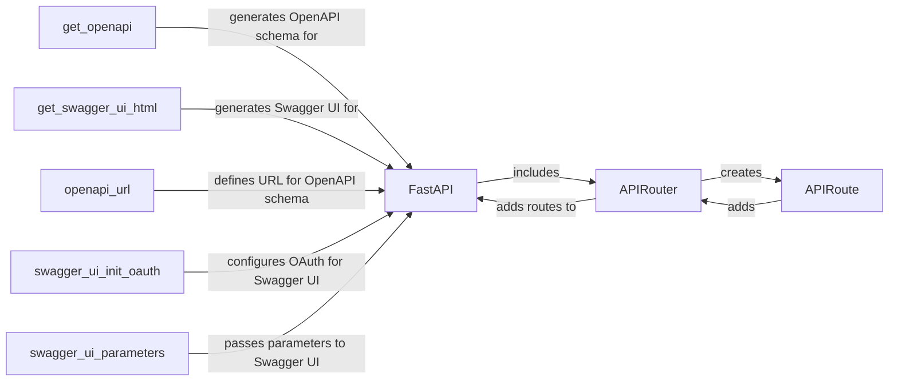

## Component Details

The OpenAPI Documentation Generation component in FastAPI automates the creation of API documentation, making it easier for developers to understand and use the API. It leverages the `FastAPI` application instance to gather information about defined routes, parameters, request bodies, and responses. The `get_openapi` function generates the OpenAPI schema, which is a JSON representation of the API specification. This schema is then used by the `get_swagger_ui_html` function to create an interactive Swagger UI, providing a user-friendly interface for exploring and testing the API. The `openapi_url`, `swagger_ui_init_oauth`, and `swagger_ui_parameters` attributes of the `FastAPI` class allow customization of the OpenAPI schema endpoint and the Swagger UI's behavior and appearance.

### FastAPI
The core application class in FastAPI, responsible for managing API routes and generating the OpenAPI schema. It inherits from Starlette and provides methods for defining API endpoints and customizing the OpenAPI documentation.
- **Related Classes/Methods**: `fastapi.fastapi.applications.FastAPI`

### APIRouter
A class for creating modular sets of API routes, allowing for grouping related endpoints and including them in the main FastAPI application. It provides the same methods for defining routes as the FastAPI class.
- **Related Classes/Methods**: `fastapi.fastapi.routing.APIRouter`

### APIRoute
Represents a single API route, associating a path, HTTP method, and endpoint function. It's the fundamental building block for defining API endpoints in FastAPI.
- **Related Classes/Methods**: `fastapi.fastapi.routing.APIRoute`

### get_openapi
A function responsible for generating the OpenAPI schema for the FastAPI application. It gathers information about all defined routes, their parameters, request bodies, and responses, and constructs a JSON object representing the API specification.
- **Related Classes/Methods**: `fastapi.openapi.utils:get_openapi`

### get_swagger_ui_html
A function that generates the HTML for the Swagger UI, which provides an interactive interface for exploring and testing the API based on the OpenAPI schema.
- **Related Classes/Methods**: `fastapi.openapi.docs:get_swagger_ui_html`

### openapi_url
A parameter of the FastAPI class that defines the URL where the OpenAPI schema will be served. It allows customization of the endpoint for accessing the schema.
- **Related Classes/Methods**: `fastapi.fastapi.applications.FastAPI`

### swagger_ui_init_oauth
A parameter of the FastAPI class that configures the OAuth settings for the Swagger UI. It enables secure access to the API documentation when OAuth is enabled.
- **Related Classes/Methods**: `fastapi.fastapi.applications.FastAPI`

### swagger_ui_parameters
A parameter of the FastAPI class that allows passing additional parameters to the Swagger UI initialization. It provides flexibility in customizing the Swagger UI's behavior and appearance.
- **Related Classes/Methods**: `fastapi.fastapi.applications.FastAPI`
