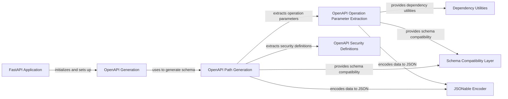

## Component Details

The OpenAPI Documentation component in FastAPI is responsible for generating the OpenAPI schema, which describes the API's endpoints, parameters, and response models. This schema is used to provide documentation and enable client generation. The process starts with the FastAPI application, which uses the OpenAPI generation module to create the schema. The OpenAPI generation module relies on other components to extract information about paths, parameters, security definitions, and request bodies. The generated schema is then used to serve the Swagger UI and ReDoc documentation.

### FastAPI Application
The FastAPI application class is the central component for creating API applications. It handles the setup, configuration, and routing of API endpoints. It initializes the application and triggers the OpenAPI schema generation.
- **Related Classes/Methods**:

- <a href="https://github.com/fastapi/fastapi/blob/master/fastapi/applications.py#L64-L964" target="_blank" rel="noopener noreferrer">`fastapi.applications.FastAPI.__init__` (64:964)</a>
- <a href="https://github.com/fastapi/fastapi/blob/master/fastapi/applications.py#L998-L1049" target="_blank" rel="noopener noreferrer">`fastapi.applications.FastAPI.setup` (998:1049)</a>
- <a href="https://github.com/fastapi/fastapi/blob/master/fastapi/applications.py#L966-L996" target="_blank" rel="noopener noreferrer">`fastapi.applications.FastAPI.openapi` (966:996)</a>

### OpenAPI Generation
The OpenAPI generation module is responsible for creating the OpenAPI schema for the API. It uses the routes, dependencies, and other information to generate a complete and accurate schema.
- **Related Classes/Methods**:

- <a href="https://github.com/fastapi/fastapi/blob/master/fastapi/openapi/utils.py#L477-L569" target="_blank" rel="noopener noreferrer">`fastapi.openapi.utils.get_openapi` (477:569)</a>

### OpenAPI Path Generation
The OpenAPI path generation module is responsible for generating the OpenAPI path items for each API endpoint. It extracts information about the path, parameters, request body, and responses to create the path item.
- **Related Classes/Methods**:

- <a href="https://github.com/fastapi/fastapi/blob/master/fastapi/openapi/utils.py#L254-L443" target="_blank" rel="noopener noreferrer">`fastapi.openapi.utils.get_openapi_path` (254:443)</a>

### OpenAPI Operation Parameter Extraction
This component extracts and processes operation parameters from dependencies and route parameters to include them in the OpenAPI schema.
- **Related Classes/Methods**:

- <a href="https://github.com/fastapi/fastapi/blob/master/fastapi/openapi/utils.py#L95-L167" target="_blank" rel="noopener noreferrer">`fastapi.openapi.utils._get_openapi_operation_parameters` (95:167)</a>

### OpenAPI Security Definitions
This component is responsible for extracting security definitions from the API's dependencies and including them in the OpenAPI schema.
- **Related Classes/Methods**:

- <a href="https://github.com/fastapi/fastapi/blob/master/fastapi/openapi/utils.py#L78-L92" target="_blank" rel="noopener noreferrer">`fastapi.openapi.utils.get_openapi_security_definitions` (78:92)</a>

### Dependency Utilities
This module provides utility functions for working with dependencies, such as extracting flat lists of dependencies and parameters.
- **Related Classes/Methods**:

- <a href="https://github.com/fastapi/fastapi/blob/master/fastapi/dependencies/utils.py#L177-L209" target="_blank" rel="noopener noreferrer">`fastapi.dependencies.utils.get_flat_dependant` (177:209)</a>
- <a href="https://github.com/fastapi/fastapi/blob/master/fastapi/dependencies/utils.py#L222-L228" target="_blank" rel="noopener noreferrer">`fastapi.dependencies.utils.get_flat_params` (222:228)</a>
- <a href="https://github.com/fastapi/fastapi/blob/master/fastapi/dependencies/utils.py#L212-L219" target="_blank" rel="noopener noreferrer">`fastapi.dependencies.utils._get_flat_fields_from_params` (212:219)</a>

### Schema Compatibility Layer
This module provides compatibility functions for working with different schema versions.
- **Related Classes/Methods**:

- <a href="https://github.com/fastapi/fastapi/blob/master/fastapi/_compat.py#L101-L130" target="_blank" rel="noopener noreferrer">`fastapi._compat.get_schema_from_model_field` (101:130)</a>
- <a href="https://github.com/fastapi/fastapi/blob/master/fastapi/_compat.py#L132-L144" target="_blank" rel="noopener noreferrer">`fastapi._compat.get_compat_model_name_map` (132:144)</a>
- <a href="https://github.com/fastapi/fastapi/blob/master/fastapi/_compat.py#L146-L164" target="_blank" rel="noopener noreferrer">`fastapi._compat.get_definitions` (146:164)</a>

### JSONable Encoder
This module provides functions for encoding data into JSON-compatible formats. It is used to encode data for the OpenAPI schema.
- **Related Classes/Methods**:

- <a href="https://github.com/fastapi/fastapi/blob/master/fastapi/encoders.py#L102-L343" target="_blank" rel="noopener noreferrer">`fastapi.encoders.jsonable_encoder` (102:343)</a>