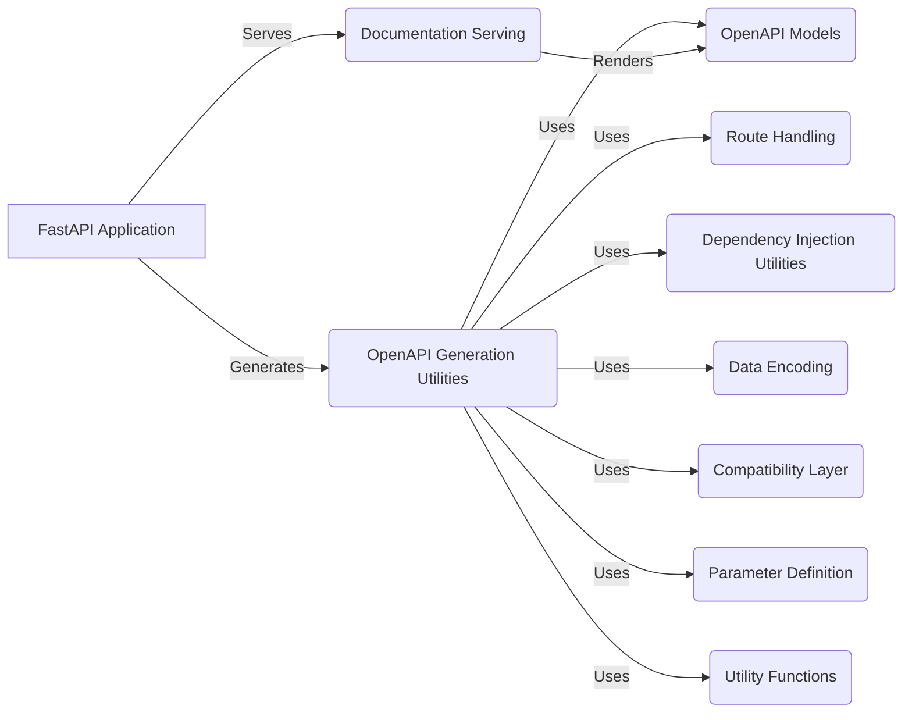

## Component Descriptions:

**FastAPI Application**
*Description*: The core application that orchestrates the OpenAPI generation process. It triggers the OpenAPI generation utilities and serves the documentation.
*Related Components*: OpenAPI Generation Utilities, Documentation Serving
*Relevant source files*: `fastapi.applications.FastAPI`

**OpenAPI Generation Utilities**
*Description*: Functions that construct the OpenAPI schema by extracting information from the application's routes, dependencies, and data models.
*Related Components*: FastAPI Application, OpenAPI Models, Route Handling, Dependency Injection Utilities, Data Encoding, Compatibility Layer, Parameter Definition, Utility Functions
*Relevant source files*: `fastapi.openapi.utils`

**OpenAPI Models**
*Description*: Pydantic models that define the structure and data types of the OpenAPI document.
*Related Components*: OpenAPI Generation Utilities, Documentation Serving
*Relevant source files*: `fastapi.openapi.models`

**Documentation Serving**
*Description*: Functions that generate the HTML for Swagger UI and ReDoc, using the OpenAPI schema to render interactive documentation.
*Related Components*: FastAPI Application, OpenAPI Models
*Relevant source files*: `fastapi.openapi.docs`

**Route Handling**
*Description*: Classes and functions for defining and handling routes, including dependency injection.
*Related Components*: OpenAPI Generation Utilities, Dependency Injection Utilities
*Relevant source files*: `fastapi.routing`

**Dependency Injection Utilities**
*Description*: Utilities for managing dependencies and parameters for route handlers.
*Related Components*: OpenAPI Generation Utilities, Route Handling
*Relevant source files*: `fastapi.dependencies.utils`

**Data Encoding**
*Description*: Function for encoding data to JSON-compatible formats.
*Related Components*: OpenAPI Generation Utilities
*Relevant source files*: `fastapi.encoders`

**Compatibility Layer**
*Description*: Utilities for handling compatibility with different Pydantic versions.
*Related Components*: OpenAPI Generation Utilities
*Relevant source files*: `fastapi._compat`

**Parameter Definition**
*Description*: Classes for defining parameters in API endpoints.
*Related Components*: OpenAPI Generation Utilities
*Relevant source files*: `fastapi.params`

**Utility Functions**
*Description*: Miscellaneous utility functions.
*Related Components*: OpenAPI Generation Utilities
*Relevant source files*: `fastapi.utils`