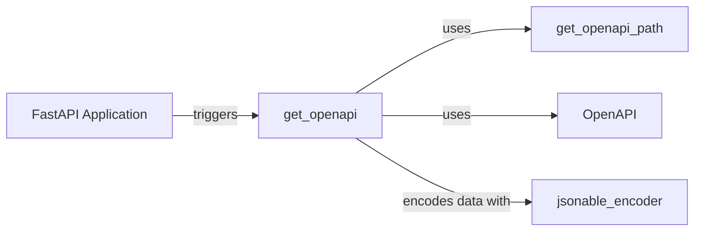

## Component Details

The OpenAPI schema generation component in FastAPI is responsible for automatically creating a specification of the API based on the defined routes, request/response models, and other metadata. This specification adheres to the OpenAPI standard and can be used for generating documentation (Swagger UI, ReDoc), client SDKs, and other tools that facilitate API consumption. The process starts with the FastAPI application instance, which then uses the `get_openapi` utility function to traverse the application's routes and extract relevant information. This information is then structured into an OpenAPI schema, which can be exposed as a JSON or YAML file.

### FastAPI Application
The core application class that inherits from Starlette and provides the main entry point for building APIs. It holds the routes, middleware, and exception handlers, and triggers the OpenAPI schema generation process.
- **Related Classes/Methods**:

['[`fastapi.applications.FastAPI` (48:4585)](https://github.com/fastapi/fastapi/blob/master/fastapi/applications.py#L48-L4585)', '[`fastapi.applications.FastAPI:openapi` (966:996)](https://github.com/fastapi/fastapi/blob/master/fastapi/applications.py#L966-L996)']

### get_openapi
This function is the central point for generating the OpenAPI schema. It takes the FastAPI application instance as input and gathers information about routes, dependencies, security definitions, and other metadata to construct a complete OpenAPI specification. It orchestrates the extraction of information from individual routes using helper functions like `get_openapi_path` and structures the data into an OpenAPI model.
- **Related Classes/Methods**:

['[`fastapi.openapi.utils.get_openapi` (477:569)](https://github.com/fastapi/fastapi/blob/master/fastapi/openapi/utils.py#L477-L569)']

### get_openapi_path
This function extracts OpenAPI schema information for a single path (route) in the FastAPI application. It gathers metadata about the path's operations, parameters, request body, and responses to construct the OpenAPI representation for that specific path. It uses other helper functions to extract specific parts of the path's OpenAPI definition.
- **Related Classes/Methods**:

['[`fastapi.openapi.utils.get_openapi_path` (254:443)](https://github.com/fastapi/fastapi/blob/master/fastapi/openapi/utils.py#L254-L443)']

### OpenAPI
Pydantic model that represents the OpenAPI schema. It defines the structure and data types for the OpenAPI specification, ensuring that the generated schema conforms to the standard.
- **Related Classes/Methods**:

['[`fastapi.openapi.models.OpenAPI` (429:440)](https://github.com/fastapi/fastapi/blob/master/fastapi/openapi/models.py#L429-L440)']

### jsonable_encoder
Encodes Python objects into JSON-compatible data structures. This is used to serialize data for the OpenAPI schema and Swagger UI.
- **Related Classes/Methods**:

['[`fastapi.encoders.jsonable_encoder` (102:343)](https://github.com/fastapi/fastapi/blob/master/fastapi/encoders.py#L102-L343)']