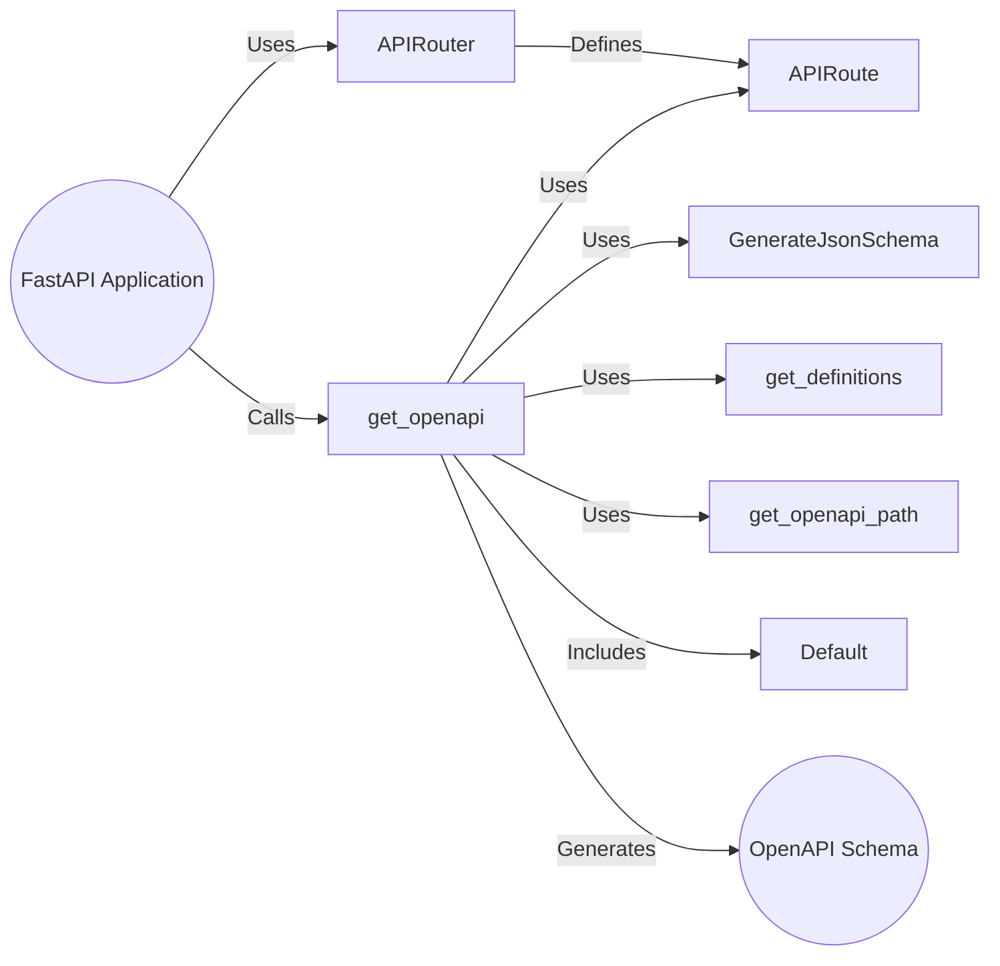

## OpenAPI Schema Generation

This component focuses on generating the OpenAPI schema for a FastAPI application. It leverages the application's routes, data models, and configurations to produce a comprehensive API documentation in the OpenAPI format.

Here's a data flow diagram illustrating the process:

## Component Descriptions:

- **FastAPI Application:** The core application instance that manages routes, middleware, and the overall API setup. It triggers the OpenAPI schema generation process.
  *Relevant files:* `fastapi.applications.FastAPI`

- **APIRouter:** A module for organizing API routes into logical groups. It contributes to the overall set of routes used in the OpenAPI schema.
  *Relevant files:* `fastapi.routing.APIRouter`

- **APIRoute:** Represents a single API endpoint, containing information about the path, HTTP method, and associated handler function. It provides the details needed to document each endpoint in the OpenAPI schema.
  *Relevant files:* `fastapi.routing.APIRoute`

- **get_openapi:** The central function responsible for generating the OpenAPI schema. It gathers information from the application's routes, data models, and configurations to construct the schema.
  *Relevant files:* `fastapi.openapi.utils.get_openapi`

- **GenerateJsonSchema:** Converts Python data types and models into JSON schema representations, which are then included in the OpenAPI schema.
  *Relevant files:* `fastapi.utils` (related functions, exact file needs further investigation)

- **get_definitions:** Extracts schema definitions from the API routes and their associated data models. These definitions are used to populate the `components.schemas` section of the OpenAPI document.
  *Relevant files:* `fastapi.openapi.utils` (related functions, exact file needs further investigation)

- **get_openapi_path:** Extracts the OpenAPI schema information for a single API path (endpoint). This information includes the path, HTTP method, parameters, request body, and responses.
  *Relevant files:* `fastapi.openapi.utils` (related functions, exact file needs further investigation)

- **Default:** A sentinel value representing default parameter values. It helps distinguish between explicitly provided values and default values when generating schemas.
  *Relevant files:* `fastapi.datastructures.Default`

- **OpenAPI Schema:** The final generated OpenAPI schema document, which describes the API's endpoints, request/response models, and other relevant information.
