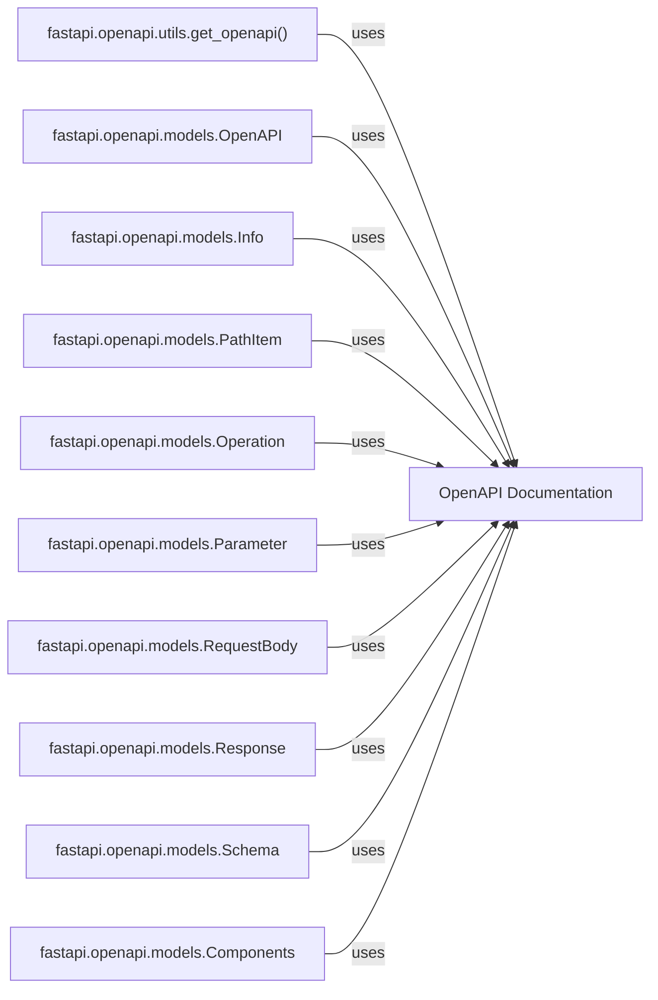

## Details

OpenAPI Documentation Component and its relations with other components

### OpenAPI Documentation [[Expand]](./OpenAPI_Documentation.md)
Generates the OpenAPI schema for the API, enabling documentation and client generation. This component is crucial for API discoverability, client SDK generation, and interactive documentation (e.g., Swagger UI).

**Related Classes/Methods**: _None_

### fastapi.openapi.utils.get_openapi()
This function is the core of the OpenAPI generation. It takes the `FastAPI` application instance as input and returns a dictionary representing the OpenAPI schema. It traverses the application's routes, dependencies, and data models to construct the schema.

**Related Classes/Methods**: _None_

### fastapi.openapi.models.OpenAPI
Pydantic model that represents the root OpenAPI schema. It includes fields for `info`, `servers`, `paths`, `components`, `security`, and `tags`.

**Related Classes/Methods**: _None_

### fastapi.openapi.models.Info
Pydantic model for the OpenAPI `info` object, containing metadata about the API like title, version, and description.

**Related Classes/Methods**: _None_

### fastapi.openapi.models.PathItem
Pydantic model representing a path in the OpenAPI schema, containing the operations (GET, POST, etc.) that can be performed on that path.

**Related Classes/Methods**: _None_

### fastapi.openapi.models.Operation
Pydantic model representing an operation (e.g., GET, POST) on a path. It includes details like parameters, request body, responses, and security requirements.

**Related Classes/Methods**: _None_

### fastapi.openapi.models.Parameter
Pydantic model representing a parameter in an operation, such as query parameters, path parameters, or headers.

**Related Classes/Methods**: _None_

### fastapi.openapi.models.RequestBody
Pydantic model representing the request body of an operation.

**Related Classes/Methods**: _None_

### fastapi.openapi.models.Response
Pydantic model representing a possible response for an operation.

**Related Classes/Methods**: _None_

### fastapi.openapi.models.Schema
Pydantic model representing a data schema used in request bodies or responses. This is where Pydantic models are converted into OpenAPI schema definitions.

**Related Classes/Methods**: _None_

### fastapi.openapi.models.Components
Pydantic model that holds reusable components like schemas, responses, parameters, security schemes, etc.

**Related Classes/Methods**: _None_

### [FAQ](https://github.com/CodeBoarding/GeneratedOnBoardings/tree/main?tab=readme-ov-file#faq)