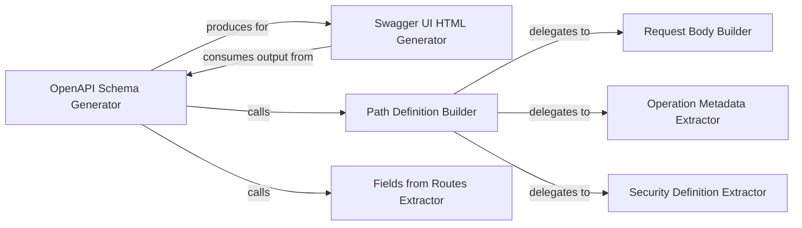

## Details

The FastAPI OpenAPI documentation generation subsystem is orchestrated by the `OpenAPI Schema Generator`, which acts as the central component for creating the comprehensive OpenAPI specification. This generator relies on the `Path Definition Builder` to process individual API routes and construct their respective OpenAPI path items, and the `Fields from Routes Extractor` to identify and define Pydantic models used in requests and responses. The `Path Definition Builder` further delegates specialized tasks to the `Request Body Builder` for defining request payloads, the `Operation Metadata Extractor` for enriching operation details, and the `Security Definition Extractor` for handling security schemes. Finally, the generated OpenAPI schema is consumed by the `Swagger UI HTML Generator` to produce the interactive API documentation interface. This modular design ensures accurate and detailed API documentation, crucial for both developers and consumers of the API.

### OpenAPI Schema Generator
This is the primary orchestrator for generating the complete OpenAPI specification (JSON/YAML) for the entire FastAPI application. It aggregates information from all defined routes, Pydantic models, and security schemes, ensuring a comprehensive and accurate API definition. This component is fundamental as it produces the core artifact for API documentation.

**Related Classes/Methods**:

- <a href="https://github.com/fastapi/fastapi/blob/master/fastapi/openapi/utils.py#L477-L569" target="_blank" rel="noopener noreferrer">`fastapi.openapi.utils.get_openapi`:477-569</a>

### Swagger UI HTML Generator
This component is responsible for generating the HTML content required to display the interactive Swagger UI documentation. It embeds the OpenAPI schema generated by the `OpenAPI Schema Generator`, providing a user-friendly interface for exploring and testing API endpoints directly in the browser. It's crucial for the user-facing aspect of the documentation.

**Related Classes/Methods**:

- <a href="https://github.com/fastapi/fastapi/blob/master/fastapi/openapi/docs.py#L26-L158" target="_blank" rel="noopener noreferrer">`fastapi.openapi.docs.get_swagger_ui_html`:26-158</a>

### Path Definition Builder
Processes individual routes to construct specific parts of the OpenAPI schema for each operation (e.g., path parameters, query parameters, responses). It acts as a specialized builder for the `paths` object within the OpenAPI specification. This component is vital for accurately representing each API endpoint.

**Related Classes/Methods**:

- <a href="https://github.com/fastapi/fastapi/blob/master/fastapi/openapi/utils.py#L254-L443" target="_blank" rel="noopener noreferrer">`fastapi.openapi.utils.get_openapi_path`:254-443</a>

### Fields from Routes Extractor
Identifies and collects Pydantic models used in requests and responses across all defined routes. It ensures that all data schemas referenced by API endpoints are properly defined in the OpenAPI specification's `components/schemas` section. This component is essential for data validation and schema generation.

**Related Classes/Methods**:

- <a href="https://github.com/fastapi/fastapi/blob/master/fastapi/openapi/utils.py#L446-L474" target="_blank" rel="noopener noreferrer">`fastapi.openapi.utils.get_fields_from_routes`:446-474</a>

### Request Body Builder
Constructs the request body part of the OpenAPI schema for each operation. This includes defining the content types, schemas, and examples for incoming data, based on the Pydantic models used in the route's request body. It's a specialized builder for a key part of API interaction.

**Related Classes/Methods**: _None_

### Operation Metadata Extractor
Extracts and formats various metadata for an individual API operation (e.g., summary, description, tags, external documentation links, deprecated status) to enrich its representation in the OpenAPI schema. This component ensures the documentation is informative and user-friendly.

**Related Classes/Methods**: _None_

### Security Definition Extractor
Identifies and processes security requirements and definitions (e.g., OAuth2, API Keys, HTTP Bearer) associated with API operations or the entire application. It ensures that security schemes are correctly represented in the OpenAPI schema's `securitySchemes` and `security` sections, crucial for secure API usage.

**Related Classes/Methods**: _None_

### [FAQ](https://github.com/CodeBoarding/GeneratedOnBoardings/tree/main?tab=readme-ov-file#faq)