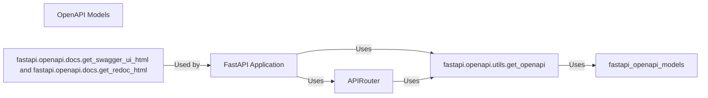

## Details

Component Overview: OpenAPI Generation. This component focuses on the automatic generation of OpenAPI specifications, which are crucial for API documentation, discoverability, and client code generation.

### FastAPI Application
The core application instance that ties everything together. It inherits from `APIRouter`.

**Related Classes/Methods**: _None_

### APIRouter
A class for creating modular and reusable route collections.

**Related Classes/Methods**: _None_

### fastapi.openapi.utils.get_openapi
Function that generates the OpenAPI schema.

**Related Classes/Methods**: _None_

### OpenAPI Models
A collection of Pydantic models representing the OpenAPI specification elements (e.g., `Info`, `PathItem`, `Operation`, `Parameter`, `Response`, `Schema`).

**Related Classes/Methods**: _None_

### fastapi.openapi.docs.get_swagger_ui_html and fastapi.openapi.docs.get_redoc_html
Functions that generate the HTML for Swagger UI and ReDoc, respectively.

**Related Classes/Methods**: _None_

### [FAQ](https://github.com/CodeBoarding/GeneratedOnBoardings/tree/main?tab=readme-ov-file#faq)