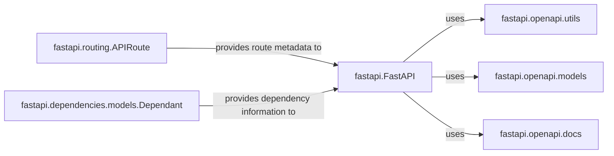

## Details

Analysis of the OpenAPI Generation component in FastAPI, identifying core components and their relationships.

### fastapi.openapi.utils
Utility functions for OpenAPI schema generation.

**Related Classes/Methods**: _None_

### fastapi.openapi.models
Pydantic models for the OpenAPI schema.

**Related Classes/Methods**: _None_

### fastapi.openapi.docs
Functions for generating OpenAPI documentation.

**Related Classes/Methods**: _None_

### fastapi.FastAPI
The main FastAPI application class.

**Related Classes/Methods**: _None_

### fastapi.routing.APIRoute
Represents a single API route.

**Related Classes/Methods**: _None_

### fastapi.dependencies.models.Dependant
Represents the dependencies of an API route.

**Related Classes/Methods**: _None_

### [FAQ](https://github.com/CodeBoarding/GeneratedOnBoardings/tree/main?tab=readme-ov-file#faq)