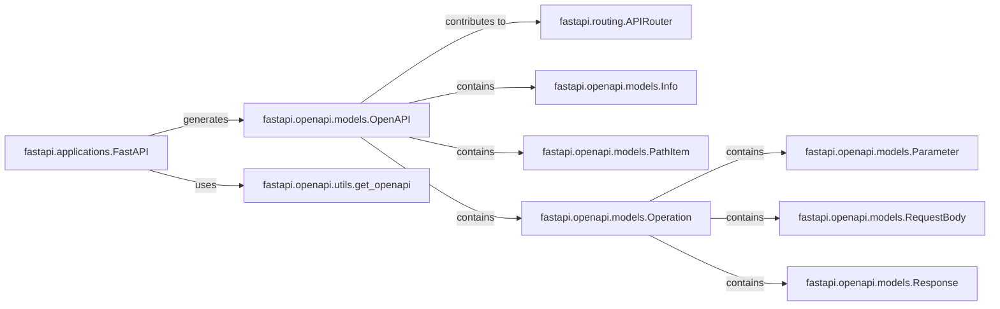

## Details

These components are fundamental to the `OpenAPI and Documentation` functionality because they work together to automatically generate and expose API documentation. `FastAPI` and `APIRouter` define the API endpoints, while the `fastapi.openapi` module provides the tools and models to create the OpenAPI schema. The generated schema can then be used to serve interactive API documentation using tools like Swagger UI or ReDoc. This automated documentation is crucial for API discoverability, usability, and maintainability.

### fastapi.applications.FastAPI
The core application class. It inherits from `APIRouter` and is responsible for initializing the OpenAPI schema generation. It uses the `OpenAPI` models to define the API structure.

**Related Classes/Methods**: _None_

### fastapi.routing.APIRouter
Used to define routes and their configurations. It contributes to the OpenAPI schema by defining the paths, methods, and parameters for each endpoint.

**Related Classes/Methods**: _None_

### fastapi.openapi.models.OpenAPI
A Pydantic model representing the OpenAPI schema itself. It contains information about the API, including its title, version, description, and endpoints.

**Related Classes/Methods**: _None_

### fastapi.openapi.utils.get_openapi
A utility function that generates the OpenAPI schema from the FastAPI application instance. It traverses the routes and their configurations to build the schema.

**Related Classes/Methods**: _None_

### fastapi.openapi.models.Info
A Pydantic model that holds the metadata for the API, such as title, version, and description. It's part of the `OpenAPI` model.

**Related Classes/Methods**: _None_

### fastapi.openapi.models.PathItem
A Pydantic model representing a specific path in the API. It contains the operations (GET, POST, PUT, DELETE, etc.) that can be performed on that path.

**Related Classes/Methods**: _None_

### fastapi.openapi.models.Operation
A Pydantic model representing a single operation on a path. It includes information about the parameters, request body, and responses for the operation.

**Related Classes/Methods**: _None_

### fastapi.openapi.models.Parameter
A Pydantic model representing a parameter for an operation. It defines the parameter's name, type, location (query, path, header, cookie), and other properties.

**Related Classes/Methods**: _None_

### fastapi.openapi.models.RequestBody
A Pydantic model representing the request body for an operation. It defines the content type and schema of the request body.

**Related Classes/Methods**: _None_

### fastapi.openapi.models.Response
A Pydantic model representing a possible response for an operation. It defines the status code, headers, and content type of the response.

**Related Classes/Methods**: _None_

### [FAQ](https://github.com/CodeBoarding/GeneratedOnBoardings/tree/main?tab=readme-ov-file#faq)