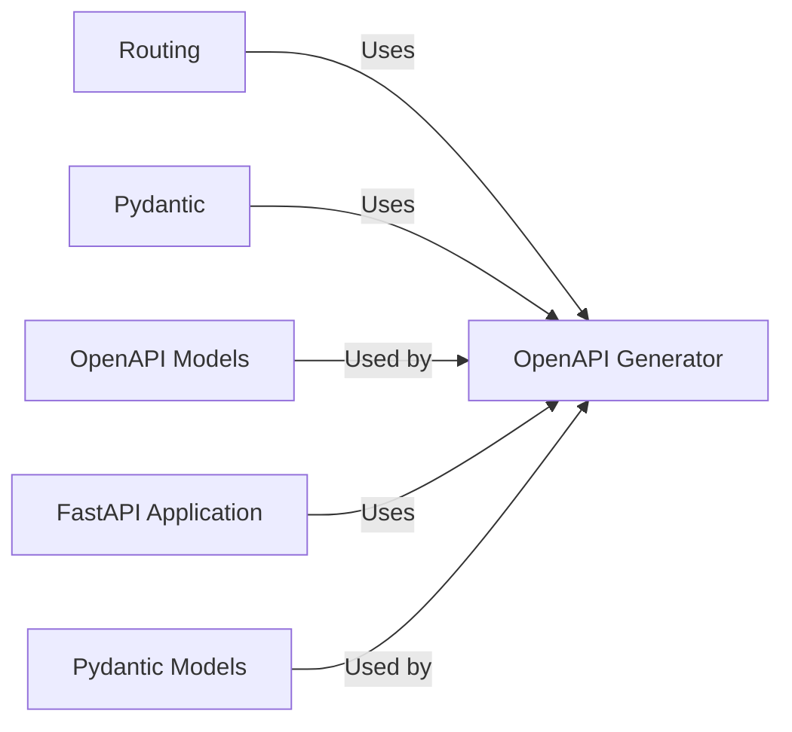

## Details

OpenAPI and Documentation component

### OpenAPI Generator
This module contains the core logic for generating the OpenAPI schema from the FastAPI application's routes, models, and dependencies.

**Related Classes/Methods**:

- <a href="https://github.com/fastapi/fastapi/blob/master/temp/fastapi/openapi/utils.py" target="_blank" rel="noopener noreferrer">`fastapi.openapi.utils`</a>
- <a href="https://github.com/fastapi/fastapi/blob/master/temp/fastapi/openapi/docs.py" target="_blank" rel="noopener noreferrer">`fastapi.openapi.docs`</a>

### OpenAPI Models
This module defines the Pydantic models that represent the OpenAPI schema components

**Related Classes/Methods**:

- <a href="https://github.com/fastapi/fastapi/blob/master/temp/fastapi/openapi/models.py" target="_blank" rel="noopener noreferrer">`fastapi.openapi.models`</a>

### FastAPI Application
The main FastAPI application class. It integrates the OpenAPI generator and serves the documentation endpoints.

**Related Classes/Methods**:

- <a href="https://github.com/fastapi/fastapi/blob/master/temp/fastapi/applications.py#L47-L4584" target="_blank" rel="noopener noreferrer">`fastapi.applications.FastAPI` (47:4584)</a>

### Pydantic Models
Pydantic is used to define the data models for request and response bodies, as well as for the OpenAPI schema itself

**Related Classes/Methods**: _None_

### [FAQ](https://github.com/CodeBoarding/GeneratedOnBoardings/tree/main?tab=readme-ov-file#faq)