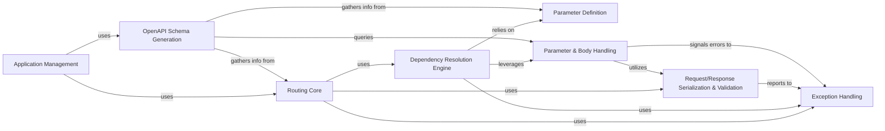

## Component Details

This graph illustrates the key components of the FastAPI framework, focusing on how an application is managed, routes are handled, dependencies are resolved, and input parameters/bodies are processed and validated. It also covers the generation of OpenAPI schemas and the handling of exceptions, showcasing the flow from request reception to response generation.

### Application Management
This component is responsible for the overall FastAPI application setup, including defining the main application instance, registering routers, and setting up global configurations like OpenAPI documentation URLs and exception handlers.

**Related Classes/Methods**:

- <a href="https://github.com/fastapi/fastapi/blob/master/fastapi/applications.py#L48-L4585" target="_blank" rel="noopener noreferrer">`fastapi.applications.FastAPI` (48:4585)</a>
- <a href="https://github.com/fastapi/fastapi/blob/master/fastapi/routing.py#L595-L4439" target="_blank" rel="noopener noreferrer">`fastapi.routing.APIRouter` (595:4439)</a>

### Routing Core
This component defines how individual API endpoints (path operations) are structured and processed. It handles the creation of route handlers, including the parsing of request bodies and the serialization of responses.

**Related Classes/Methods**:

- <a href="https://github.com/fastapi/fastapi/blob/master/fastapi/routing.py#L428-L592" target="_blank" rel="noopener noreferrer">`fastapi.fastapi.routing.APIRoute` (428:592)</a>
- <a href="https://github.com/fastapi/fastapi/blob/master/fastapi/routing.py#L217-L357" target="_blank" rel="noopener noreferrer">`fastapi.fastapi.routing.get_request_handler` (217:357)</a>
- <a href="https://github.com/fastapi/fastapi/blob/master/fastapi/routing.py#L204-L214" target="_blank" rel="noopener noreferrer">`fastapi.fastapi.routing.run_endpoint_function` (204:214)</a>
- <a href="https://github.com/fastapi/fastapi/blob/master/fastapi/routing.py#L143-L201" target="_blank" rel="noopener noreferrer">`fastapi.fastapi.routing.serialize_response` (143:201)</a>

### Dependency Resolution Engine
This crucial component is responsible for analyzing endpoint signatures, identifying dependencies, and resolving them by extracting values from the request (path, query, headers, cookies, body) and injecting them into the endpoint function. It also handles nested dependencies and manages dependency caching.

**Related Classes/Methods**:

- <a href="https://github.com/fastapi/fastapi/blob/master/fastapi/dependencies/utils.py#L572-L695" target="_blank" rel="noopener noreferrer">`fastapi.fastapi.dependencies.utils.solve_dependencies` (572:695)</a>
- <a href="https://github.com/fastapi/fastapi/blob/master/fastapi/dependencies/utils.py#L265-L314" target="_blank" rel="noopener noreferrer">`fastapi.fastapi.dependencies.utils.get_dependant` (265:314)</a>
- <a href="https://github.com/fastapi/fastapi/blob/master/fastapi/dependencies/utils.py#L135-L139" target="_blank" rel="noopener noreferrer">`fastapi.fastapi.dependencies.utils.get_parameterless_sub_dependant` (135:139)</a>
- <a href="https://github.com/fastapi/fastapi/blob/master/fastapi/dependencies/utils.py#L142-L171" target="_blank" rel="noopener noreferrer">`fastapi.fastapi.dependencies.utils.get_sub_dependant` (142:171)</a>
- <a href="https://github.com/fastapi/fastapi/blob/master/fastapi/dependencies/utils.py#L177-L209" target="_blank" rel="noopener noreferrer">`fastapi.fastapi.dependencies.utils.get_flat_dependant` (177:209)</a>
- <a href="https://github.com/fastapi/fastapi/blob/master/fastapi/dependencies/utils.py#L348-L511" target="_blank" rel="noopener noreferrer">`fastapi.fastapi.dependencies.utils.analyze_param` (348:511)</a>
- <a href="https://github.com/fastapi/fastapi/blob/master/fastapi/dependencies/utils.py#L740-L816" target="_blank" rel="noopener noreferrer">`fastapi.fastapi.dependencies.utils.request_params_to_args` (740:816)</a>
- <a href="https://github.com/fastapi/fastapi/blob/master/fastapi/dependencies/utils.py#L884-L927" target="_blank" rel="noopener noreferrer">`fastapi.fastapi.dependencies.utils.request_body_to_args` (884:927)</a>
- <a href="https://github.com/fastapi/fastapi/blob/master/fastapi/dependencies/utils.py#L930-L980" target="_blank" rel="noopener noreferrer">`fastapi.fastapi.dependencies.utils.get_body_field` (930:980)</a>

### Parameter Definition
This component provides classes and functions for defining and validating various types of API parameters, such as path parameters, query parameters, headers, cookies, and request bodies (JSON, form data, files). These definitions are used by the Dependency Resolution Engine to parse incoming requests.

**Related Classes/Methods**:

- <a href="https://github.com/fastapi/fastapi/blob/master/fastapi/params.py#L25-L136" target="_blank" rel="noopener noreferrer">`fastapi.fastapi.params.Param` (25:136)</a>
- <a href="https://github.com/fastapi/fastapi/blob/master/fastapi/params.py#L139-L222" target="_blank" rel="noopener noreferrer">`fastapi.fastapi.params.Path` (139:222)</a>
- <a href="https://github.com/fastapi/fastapi/blob/master/fastapi/params.py#L225-L306" target="_blank" rel="noopener noreferrer">`fastapi.fastapi.params.Query` (225:306)</a>
- <a href="https://github.com/fastapi/fastapi/blob/master/fastapi/params.py#L309-L392" target="_blank" rel="noopener noreferrer">`fastapi.fastapi.params.Header` (309:392)</a>
- <a href="https://github.com/fastapi/fastapi/blob/master/fastapi/params.py#L395-L476" target="_blank" rel="noopener noreferrer">`fastapi.fastapi.params.Cookie` (395:476)</a>
- <a href="https://github.com/fastapi/fastapi/blob/master/fastapi/params.py#L479-L593" target="_blank" rel="noopener noreferrer">`fastapi.fastapi.params.Body` (479:593)</a>
- <a href="https://github.com/fastapi/fastapi/blob/master/fastapi/params.py#L596-L677" target="_blank" rel="noopener noreferrer">`fastapi.fastapi.params.Form` (596:677)</a>
- <a href="https://github.com/fastapi/fastapi/blob/master/fastapi/params.py#L680-L761" target="_blank" rel="noopener noreferrer">`fastapi.fastapi.params.File` (680:761)</a>
- <a href="https://github.com/fastapi/fastapi/blob/master/fastapi/param_functions.py#L11-L336" target="_blank" rel="noopener noreferrer">`fastapi.fastapi.param_functions.Path` (11:336)</a>
- <a href="https://github.com/fastapi/fastapi/blob/master/fastapi/param_functions.py#L339-L640" target="_blank" rel="noopener noreferrer">`fastapi.fastapi.param_functions.Query` (339:640)</a>
- <a href="https://github.com/fastapi/fastapi/blob/master/fastapi/param_functions.py#L643-L956" target="_blank" rel="noopener noreferrer">`fastapi.fastapi.param_functions.Header` (643:956)</a>
- <a href="https://github.com/fastapi/fastapi/blob/master/fastapi/param_functions.py#L959-L1260" target="_blank" rel="noopener noreferrer">`fastapi.fastapi.param_functions.Cookie` (959:1260)</a>
- <a href="https://github.com/fastapi/fastapi/blob/master/fastapi/param_functions.py#L1263-L1589" target="_blank" rel="noopener noreferrer">`fastapi.fastapi.param_functions.Body` (1263:1589)</a>
- <a href="https://github.com/fastapi/fastapi/blob/master/fastapi/param_functions.py#L1592-L1903" target="_blank" rel="noopener noreferrer">`fastapi.fastapi.param_functions.Form` (1592:1903)</a>
- <a href="https://github.com/fastapi/fastapi/blob/master/fastapi/param_functions.py#L1906-L2217" target="_blank" rel="noopener noreferrer">`fastapi.fastapi.param_functions.File` (1906:2217)</a>

### Parameter & Body Handling
This component encompasses the mechanisms for both defining various input parameters (Path, Query, Header, Cookie) and request bodies (JSON, Form, File uploads), and for their subsequent runtime processing, extraction, and initial validation from incoming HTTP requests. It ensures that the input data conforms to the declared schemas and prepares them for consumption by endpoint functions.

**Related Classes/Methods**:

- <a href="https://github.com/fastapi/fastapi/blob/master/fastapi/params.py#L139-L222" target="_blank" rel="noopener noreferrer">`fastapi.fastapi.params.Path` (139:222)</a>
- <a href="https://github.com/fastapi/fastapi/blob/master/fastapi/params.py#L225-L306" target="_blank" rel="noopener noreferrer">`fastapi.fastapi.params.Query` (225:306)</a>
- <a href="https://github.com/fastapi/fastapi/blob/master/fastapi/params.py#L309-L392" target="_blank" rel="noopener noreferrer">`fastapi.fastapi.params.Header` (309:392)</a>
- <a href="https://github.com/fastapi/fastapi/blob/master/fastapi/params.py#L395-L476" target="_blank" rel="noopener noreferrer">`fastapi.fastapi.params.Cookie` (395:476)</a>
- <a href="https://github.com/fastapi/fastapi/blob/master/fastapi/params.py#L479-L593" target="_blank" rel="noopener noreferrer">`fastapi.fastapi.params.Body` (479:593)</a>
- <a href="https://github.com/fastapi/fastapi/blob/master/fastapi/params.py#L596-L677" target="_blank" rel="noopener noreferrer">`fastapi.fastapi.params.Form` (596:677)</a>
- <a href="https://github.com/fastapi/fastapi/blob/master/fastapi/params.py#L680-L761" target="_blank" rel="noopener noreferrer">`fastapi.fastapi.params.File` (680:761)</a>
- <a href="https://github.com/fastapi/fastapi/blob/master/fastapi/dependencies/utils.py#L740-L816" target="_blank" rel="noopener noreferrer">`fastapi.fastapi.dependencies.utils.request_params_to_args` (740:816)</a>
- <a href="https://github.com/fastapi/fastapi/blob/master/fastapi/dependencies/utils.py#L884-L927" target="_blank" rel="noopener noreferrer">`fastapi.fastapi.dependencies.utils.request_body_to_args` (884:927)</a>
- <a href="https://github.com/fastapi/fastapi/blob/master/fastapi/dependencies/utils.py#L930-L980" target="_blank" rel="noopener noreferrer">`fastapi.fastapi.dependencies.utils.get_body_field` (930:980)</a>

### OpenAPI Schema Generation
This component is responsible for dynamically generating the OpenAPI (Swagger/ReDoc) schema for the API. It gathers information about routes, parameters, request bodies, and responses to construct the API documentation.

**Related Classes/Methods**:

- <a href="https://github.com/fastapi/fastapi/blob/master/fastapi/openapi/utils.py#L254-L443" target="_blank" rel="noopener noreferrer">`fastapi.fastapi.openapi.utils.get_openapi_path` (254:443)</a>
- <a href="https://github.com/fastapi/fastapi/blob/master/fastapi/openapi/utils.py#L95-L167" target="_blank" rel="noopener noreferrer">`fastapi.fastapi.openapi.utils._get_openapi_operation_parameters` (95:167)</a>
- <a href="https://github.com/fastapi/fastapi/blob/master/fastapi/openapi/utils.py#L170-L204" target="_blank" rel="noopener noreferrer">`fastapi.fastapi.openapi.utils.get_openapi_operation_request_body` (170:204)</a>
- <a href="https://github.com/fastapi/fastapi/blob/master/fastapi/openapi/utils.py#L78-L92" target="_blank" rel="noopener noreferrer">`fastapi.fastapi.openapi.utils.get_openapi_security_definitions` (78:92)</a>

### Exception Handling
This component defines and manages various exceptions that can occur during request processing, such as validation errors and HTTP errors, ensuring appropriate error responses are returned to the client.

**Related Classes/Methods**:

- <a href="https://github.com/fastapi/fastapi/blob/master/fastapi/exceptions.py#L157-L160" target="_blank" rel="noopener noreferrer">`fastapi.exceptions.RequestValidationError` (157:160)</a>
- <a href="https://github.com/fastapi/fastapi/blob/master/fastapi/exceptions.py#L143-L146" target="_blank" rel="noopener noreferrer">`fastapi.exceptions.FastAPIError` (143:146)</a>
- <a href="https://github.com/fastapi/fastapi/blob/master/fastapi/exceptions.py#L9-L65" target="_blank" rel="noopener noreferrer">`fastapi.exceptions.HTTPException` (9:65)</a>
- <a href="https://github.com/fastapi/fastapi/blob/master/fastapi/exceptions.py#L68-L136" target="_blank" rel="noopener noreferrer">`fastapi.exceptions.WebSocketException` (68:136)</a>

### Request/Response Serialization & Validation
This component is responsible for serializing Python objects into JSON-compatible formats for responses and validating incoming request data against defined schemas. It leverages Pydantic for data validation and serialization.

**Related Classes/Methods**:

- <a href="https://github.com/fastapi/fastapi/blob/master/fastapi/encoders.py#L102-L343" target="_blank" rel="noopener noreferrer">`fastapi.encoders.jsonable_encoder` (102:343)</a>

### [FAQ](https://github.com/CodeBoarding/GeneratedOnBoardings/tree/main?tab=readme-ov-file#faq)