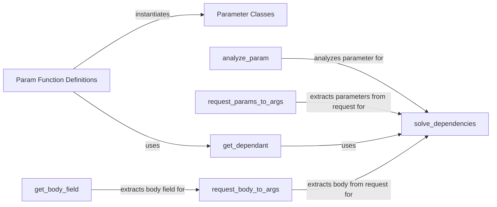

## Component Details

The Parameter Definition and Validation subsystem in FastAPI is responsible for defining how parameters are declared in path operations and ensuring that the data received by the API is valid and consistent. It involves defining parameter types (query, path, body, etc.), extracting parameter values from requests, and validating those values against specified constraints. This subsystem ensures that route handlers receive correctly formatted and validated data, contributing to the overall reliability and security of the API.

### Param Function Definitions
This component defines the functions (`Query`, `Path`, `Header`, `Cookie`, `Body`, `Form`, `File`) used to declare parameters in path operations. These functions serve as defaults for dependencies and provide metadata for validation and documentation. They essentially create instances of the parameter classes.
- **Related Classes/Methods**: `fastapi/param_functions.py`

### Parameter Classes
This component defines the classes (`Path`, `Query`, `Header`, `Cookie`, `Body`, `Form`, `File`) which are instantiated by the functions in `param_functions.py`. These classes inherit from `Param` and store information about the parameter, such as its default value, whether it's required, and any validation rules. They encapsulate the parameter's properties and constraints.
- **Related Classes/Methods**: `fastapi/params.py`

### analyze_param
Analyzes a single parameter of a route handler to determine its type, default value, and other properties. This information is used to resolve the parameter's value during dependency injection. It inspects the parameter's type annotation and any default values or `Param` instances to determine how to extract and validate the parameter.
- **Related Classes/Methods**: `fastapi/dependencies/utils.py`

### get_body_field
Extracts and validates the body field from the request. It handles parsing the request body based on the content type and validating the extracted data against the expected schema. This component ensures that the request body conforms to the defined structure and data types.
- **Related Classes/Methods**: `fastapi/dependencies/utils.py`

### request_params_to_args
Extracts path, query, and header parameters from the request and converts them into arguments that can be passed to the route handler. It retrieves the parameter values from the request based on their names and types, and then converts them into the appropriate data types for the handler.
- **Related Classes/Methods**: `fastapi/dependencies/utils.py`

### request_body_to_args
Extracts the request body and converts it into arguments that can be passed to the route handler. It handles different content types and performs validation if necessary. This component is responsible for deserializing the request body into a Python object that can be used by the route handler.
- **Related Classes/Methods**: `fastapi/dependencies/utils.py`

### get_dependant
Extracts dependency information from a callable (e.g., a function or class method). It analyzes the parameters of the callable and determines their types, default values, and dependencies. This component is crucial for dependency injection, as it identifies the dependencies that need to be resolved before the callable can be executed.
- **Related Classes/Methods**: `fastapi/dependencies/utils.py`

### solve_dependencies
Resolves the dependencies of a route handler. It inspects the handler's signature, determines the dependencies, and retrieves the values for those dependencies, potentially using dependency injection. This component orchestrates the process of extracting, validating, and providing the necessary parameters to the route handler.
- **Related Classes/Methods**: `fastapi/dependencies/utils.py`
