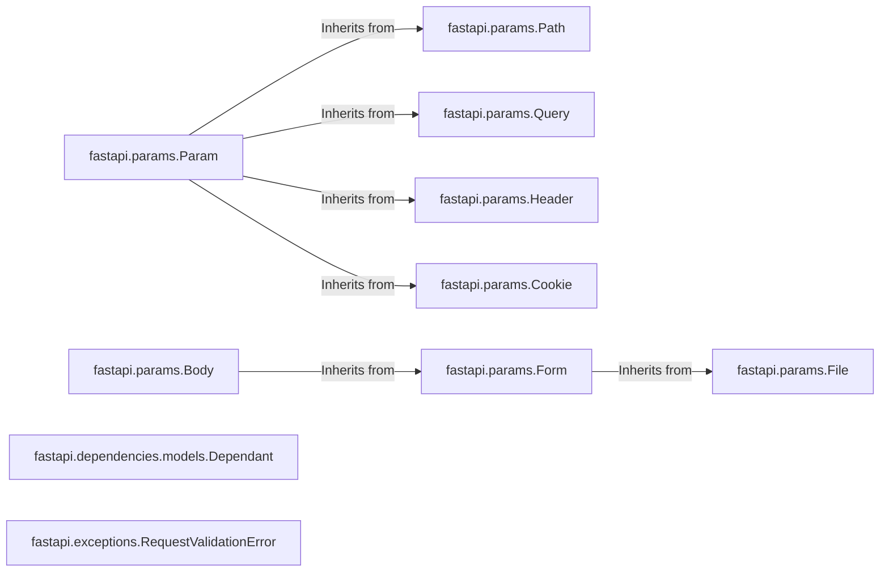

## Details

This component is responsible for defining, extracting, validating, and converting parameters from HTTP requests in FastAPI. It handles various parameter types, including path parameters, query parameters, header parameters, cookie parameters, and request body parameters. It leverages Pydantic for data validation and conversion.

### fastapi.params.Param
Base class for all parameter types. It defines common attributes like `default`, `alias`, `title`, `description`, etc.

**Related Classes/Methods**: _None_

### fastapi.params.Path
Represents a path parameter.

**Related Classes/Methods**: _None_

### fastapi.params.Query
Represents a query parameter.

**Related Classes/Methods**: _None_

### fastapi.params.Header
Represents a header parameter.

**Related Classes/Methods**: _None_

### fastapi.params.Cookie
Represents a cookie parameter.

**Related Classes/Methods**: _None_

### fastapi.params.Body
Represents the request body. It can handle different content types (JSON, form data, etc.).

**Related Classes/Methods**: _None_

### fastapi.params.Form
Represents form data in the request body.

**Related Classes/Methods**: _None_

### fastapi.params.File
Represents a file upload in the request body (part of form data).

**Related Classes/Methods**: _None_

### fastapi.dependencies.models.Dependant
Manages dependencies for route handling, including parameter validation and dependency injection.

**Related Classes/Methods**: _None_

### fastapi.exceptions.RequestValidationError
Exception raised when request data (including parameters) fails validation.

**Related Classes/Methods**: _None_

### [FAQ](https://github.com/CodeBoarding/GeneratedOnBoardings/tree/main?tab=readme-ov-file#faq)